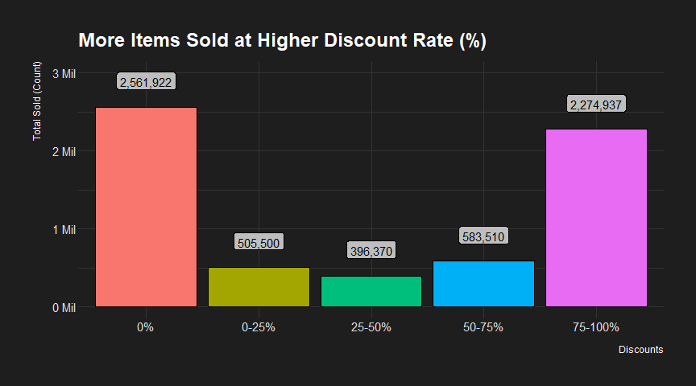
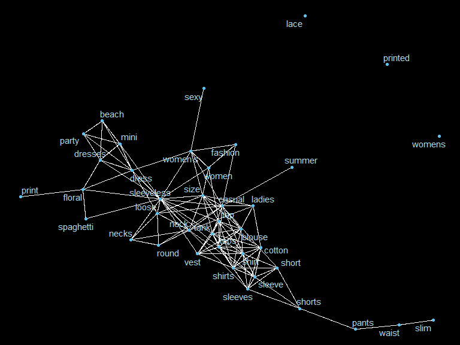

Data Analysis plus model development for product success
================
Kar Ng
2021

-   [1 R Libraries](#1-r-libraries)
-   [2 Introduction](#2-introduction)
-   [3 Data Preparation](#3-data-preparation)
    -   [3.1 Data Importation](#31-data-importation)
    -   [3.2 Data Description](#32-data-description)
    -   [3.3 Data Exploration](#33-data-exploration)
-   [4 Data Cleaning](#4-data-cleaning)
    -   [4.1 Remove variables](#41-remove-variables)
    -   [4.2 Remove missing values](#42-remove-missing-values)
    -   [4.3 Factor conversion](#43-factor-conversion)
    -   [4.4 Typos in the factor
        variables](#44-typos-in-the-factor-variables)
    -   [4.5 Examining the Rating](#45-examining-the-rating)
    -   [4.6 New Metric: price\_drop](#46-new-metric-price_drop)
    -   [4.6 New Metric: discount\_per](#46-new-metric-discount_per)
    -   [4.7 New Metric: price\_class](#47-new-metric-price_class)
-   [5 Visualisation](#5-visualisation)
    -   [5.1 Validated! Human sensitive to price
        drops](#51-validated-human-sensitive-to-price-drops)
    -   [5.2 Typical top product
        categories](#52-typical-top-product-categories)
    -   [5.3 The Effect of Rating on
        Sales](#53-the-effect-of-rating-on-sales)
    -   [5.4 Logarithmically graphing the
        Fame](#54-logarithmically-graphing-the-fame)
    -   [5.5 Tags (Text) Analysis](#55-tags-text-analysis)
-   [6 Staitistcal Analysis](#6-staitistcal-analysis)
    -   [6.1 Feature Selection](#61-feature-selection)
    -   [6.2 EDA](#62-eda)
        -   [6.2.1 Histogram](#621-histogram)
        -   [6.2.2 Boxplot](#622-boxplot)
        -   [6.3.3 Relationship Curve](#633-relationship-curve)
        -   [6.3.3 Correlogram](#633-correlogram)
    -   [6.3 Inferential Model](#63-inferential-model)
-   [7 Predictive Aanalysis](#7-predictive-aanalysis)
-   [Legality](#legality)
-   [Reference](#reference)

------------------------------------------------------------------------

------------------------------------------------------------------------

## 1 R Libraries

``` r
library(tidyverse)
library(kableExtra)
library(skimr)
library(lubridate)
library(hrbrthemes)
library(hrbrthemes)
library(tidytext)
library(ggExtra)
library(patchwork)
library(tidytext)
library(corrplot)

# Format setting

options(scipen = 999)
```

## 2 Introduction

This project will analyse a public dataset on *Kaggle* website, named
“Sales of Summer clothes in E-commerce Wish”. As the name suggests, this
dataset will include information related to the sales of summer clothes
on Wish. There are 43 columns of variables in the dataset including
price, units\_sold, rating, tags, colour, countries shipped to and etc.

A series of tasks that this project will answer include:

-   How about trying to validate the established idea of human
    sensitiveness to price drops ?

-   You may look for top categories of products so that you know what
    sells best

-   Do bad products sell ? How about the relationship between the
    quality of a product (ratings) and its success ? Does the price
    factor into this ?

-   Do seller’s fame factor into top products ?

-   Do the number of tags (making a product more discoverable) factor
    into the success of a product ?

Two popular data analysis techniques will be applied - exploratory data
analysis and machine learning. The machine learning technique is to
build models and choose the best one to predict *how well a product is
going to sell*.

## 3 Data Preparation

The dataset is downloaded from kaggle website, visit this
[Link](https://www.kaggle.com/jmmvutu/summer-products-and-sales-in-ecommerce-wish/tasks?taskId=1617)
and uploaded to R to complete the analysis.

### 3.1 Data Importation

``` r
cloth <- read_csv("summer.csv")
```

    ## Rows: 1573 Columns: 43

    ## -- Column specification --------------------------------------------------------
    ## Delimiter: ","
    ## chr (19): title, title_orig, currency_buyer, tags, product_color, product_va...
    ## dbl (24): price, retail_price, units_sold, uses_ad_boosts, rating, rating_co...

    ## 
    ## i Use `spec()` to retrieve the full column specification for this data.
    ## i Specify the column types or set `show_col_types = FALSE` to quiet this message.

### 3.2 Data Description

``` r
Variable <- names(cloth)

Description <- c("Title for localized for european countries. May be the same as title_orig if the seller did not offer a translation.", 
                 "Original english title of the product.",
                 "Price you would pay to get the product.",
                 "Reference price for similar articles on the market, or in other stores/places. Used by the seller to indicate a regular value or the price before discount.",
                 "Currency of the prices.",
                 "Number of units sold. Lower bound approximation by steps",
                 "Whether the seller paid to boost his product within the platform (highlighting, better placement or whatever)",
                 "Mean product rating.",
                 "Total number of ratings of the product",
                 "Number of 5-star ratings",
                 "Number of 4-star ratings",
                 "Number of 3-star ratings",
                 "Number of 2-star ratings",                 
                 "Number of 1-star ratings",
                 "Number of badges the product or the seller have",
                 "A badge that denotes the product is a local product. Conditions may vary (being produced locally, or something else). Some people may prefer buying local products rather than. 1 means Yes, has the badge",
                 "Badge awarded when many buyers consistently gave good evaluations. 1 means Yes, has the badge",
                 "Badge awarded when this product's order is consistently shipped rapidly",
                 "tags set by the seller",
                 "Product's main color",
                 "One of the available size variation for this product",
                 "Inventory the seller has. Max allowed quantity is 50",
                 "shipping_option_name",
                 "shipping price",
                 "whether the shipping is express or not. 1 for True",
                 "Number of countries this product is shipped to. Sellers may choose to limit where they ship a product to",
                 "Total inventory for all the product's variations (size/color variations for instance)",
                 "Whether there was an urgency banner with an urgency",
                 "A text banner that appear over some products in the search results.",
                 "origin_country",
                 "Merchant's displayed name (show in the UI as the seller's shop name)",
                 "Merchant's canonical name. A name not shown publicly. Used by the website under the hood as a canonical name. Easier to process since all lowercase without white space",
                 "The subtitle text as shown on a seller's info section to the user. (raw, not preprocessed). The website shows this to the user to give an overview of the seller's stats to the user. Mostly consists of `% <positive_feedbacks> (<rating_count> reviews)` written in french",
                 "Number of ratings of this seller",
                 "merchant's rating",
                 "merchant unique id",
                 "Convenience boolean that says whether there is a `merchant_profile_picture` url",
                 "Custom profile picture of the seller (if the seller has one). Empty otherwise",
                 "url to the product page. You may need to login to access it",
                 "Product_picture",
                 "product identifier. You can use this key to remove duplicate entries if you're not interested in studying them.",
                 "the search term used in the search bar of the website to get these search results.",
                 "meta: for info only.")


data.frame(Variable, Description) %>% 
  kbl(caption = "Adapated from the Kaggle Website.") %>% 
  kable_styling(bootstrap_options = c("striped", "bordered"))
```

<table class="table table-striped table-bordered" style="margin-left: auto; margin-right: auto;">
<caption>
Adapated from the Kaggle Website.
</caption>
<thead>
<tr>
<th style="text-align:left;">
Variable
</th>
<th style="text-align:left;">
Description
</th>
</tr>
</thead>
<tbody>
<tr>
<td style="text-align:left;">
title
</td>
<td style="text-align:left;">
Title for localized for european countries. May be the same as
title\_orig if the seller did not offer a translation.
</td>
</tr>
<tr>
<td style="text-align:left;">
title\_orig
</td>
<td style="text-align:left;">
Original english title of the product.
</td>
</tr>
<tr>
<td style="text-align:left;">
price
</td>
<td style="text-align:left;">
Price you would pay to get the product.
</td>
</tr>
<tr>
<td style="text-align:left;">
retail\_price
</td>
<td style="text-align:left;">
Reference price for similar articles on the market, or in other
stores/places. Used by the seller to indicate a regular value or the
price before discount.
</td>
</tr>
<tr>
<td style="text-align:left;">
currency\_buyer
</td>
<td style="text-align:left;">
Currency of the prices.
</td>
</tr>
<tr>
<td style="text-align:left;">
units\_sold
</td>
<td style="text-align:left;">
Number of units sold. Lower bound approximation by steps
</td>
</tr>
<tr>
<td style="text-align:left;">
uses\_ad\_boosts
</td>
<td style="text-align:left;">
Whether the seller paid to boost his product within the platform
(highlighting, better placement or whatever)
</td>
</tr>
<tr>
<td style="text-align:left;">
rating
</td>
<td style="text-align:left;">
Mean product rating.
</td>
</tr>
<tr>
<td style="text-align:left;">
rating\_count
</td>
<td style="text-align:left;">
Total number of ratings of the product
</td>
</tr>
<tr>
<td style="text-align:left;">
rating\_five\_count
</td>
<td style="text-align:left;">
Number of 5-star ratings
</td>
</tr>
<tr>
<td style="text-align:left;">
rating\_four\_count
</td>
<td style="text-align:left;">
Number of 4-star ratings
</td>
</tr>
<tr>
<td style="text-align:left;">
rating\_three\_count
</td>
<td style="text-align:left;">
Number of 3-star ratings
</td>
</tr>
<tr>
<td style="text-align:left;">
rating\_two\_count
</td>
<td style="text-align:left;">
Number of 2-star ratings
</td>
</tr>
<tr>
<td style="text-align:left;">
rating\_one\_count
</td>
<td style="text-align:left;">
Number of 1-star ratings
</td>
</tr>
<tr>
<td style="text-align:left;">
badges\_count
</td>
<td style="text-align:left;">
Number of badges the product or the seller have
</td>
</tr>
<tr>
<td style="text-align:left;">
badge\_local\_product
</td>
<td style="text-align:left;">
A badge that denotes the product is a local product. Conditions may vary
(being produced locally, or something else). Some people may prefer
buying local products rather than. 1 means Yes, has the badge
</td>
</tr>
<tr>
<td style="text-align:left;">
badge\_product\_quality
</td>
<td style="text-align:left;">
Badge awarded when many buyers consistently gave good evaluations. 1
means Yes, has the badge
</td>
</tr>
<tr>
<td style="text-align:left;">
badge\_fast\_shipping
</td>
<td style="text-align:left;">
Badge awarded when this product’s order is consistently shipped rapidly
</td>
</tr>
<tr>
<td style="text-align:left;">
tags
</td>
<td style="text-align:left;">
tags set by the seller
</td>
</tr>
<tr>
<td style="text-align:left;">
product\_color
</td>
<td style="text-align:left;">
Product’s main color
</td>
</tr>
<tr>
<td style="text-align:left;">
product\_variation\_size\_id
</td>
<td style="text-align:left;">
One of the available size variation for this product
</td>
</tr>
<tr>
<td style="text-align:left;">
product\_variation\_inventory
</td>
<td style="text-align:left;">
Inventory the seller has. Max allowed quantity is 50
</td>
</tr>
<tr>
<td style="text-align:left;">
shipping\_option\_name
</td>
<td style="text-align:left;">
shipping\_option\_name
</td>
</tr>
<tr>
<td style="text-align:left;">
shipping\_option\_price
</td>
<td style="text-align:left;">
shipping price
</td>
</tr>
<tr>
<td style="text-align:left;">
shipping\_is\_express
</td>
<td style="text-align:left;">
whether the shipping is express or not. 1 for True
</td>
</tr>
<tr>
<td style="text-align:left;">
countries\_shipped\_to
</td>
<td style="text-align:left;">
Number of countries this product is shipped to. Sellers may choose to
limit where they ship a product to
</td>
</tr>
<tr>
<td style="text-align:left;">
inventory\_total
</td>
<td style="text-align:left;">
Total inventory for all the product’s variations (size/color variations
for instance)
</td>
</tr>
<tr>
<td style="text-align:left;">
has\_urgency\_banner
</td>
<td style="text-align:left;">
Whether there was an urgency banner with an urgency
</td>
</tr>
<tr>
<td style="text-align:left;">
urgency\_text
</td>
<td style="text-align:left;">
A text banner that appear over some products in the search results.
</td>
</tr>
<tr>
<td style="text-align:left;">
origin\_country
</td>
<td style="text-align:left;">
origin\_country
</td>
</tr>
<tr>
<td style="text-align:left;">
merchant\_title
</td>
<td style="text-align:left;">
Merchant’s displayed name (show in the UI as the seller’s shop name)
</td>
</tr>
<tr>
<td style="text-align:left;">
merchant\_name
</td>
<td style="text-align:left;">
Merchant’s canonical name. A name not shown publicly. Used by the
website under the hood as a canonical name. Easier to process since all
lowercase without white space
</td>
</tr>
<tr>
<td style="text-align:left;">
merchant\_info\_subtitle
</td>
<td style="text-align:left;">
The subtitle text as shown on a seller’s info section to the user. (raw,
not preprocessed). The website shows this to the user to give an
overview of the seller’s stats to the user. Mostly consists of
`% &lt;positive_feedbacks&gt; (&lt;rating_count&gt; reviews)` written in
french
</td>
</tr>
<tr>
<td style="text-align:left;">
merchant\_rating\_count
</td>
<td style="text-align:left;">
Number of ratings of this seller
</td>
</tr>
<tr>
<td style="text-align:left;">
merchant\_rating
</td>
<td style="text-align:left;">
merchant’s rating
</td>
</tr>
<tr>
<td style="text-align:left;">
merchant\_id
</td>
<td style="text-align:left;">
merchant unique id
</td>
</tr>
<tr>
<td style="text-align:left;">
merchant\_has\_profile\_picture
</td>
<td style="text-align:left;">
Convenience boolean that says whether there is a
`merchant_profile_picture` url
</td>
</tr>
<tr>
<td style="text-align:left;">
merchant\_profile\_picture
</td>
<td style="text-align:left;">
Custom profile picture of the seller (if the seller has one). Empty
otherwise
</td>
</tr>
<tr>
<td style="text-align:left;">
product\_url
</td>
<td style="text-align:left;">
url to the product page. You may need to login to access it
</td>
</tr>
<tr>
<td style="text-align:left;">
product\_picture
</td>
<td style="text-align:left;">
Product\_picture
</td>
</tr>
<tr>
<td style="text-align:left;">
product\_id
</td>
<td style="text-align:left;">
product identifier. You can use this key to remove duplicate entries if
you’re not interested in studying them.
</td>
</tr>
<tr>
<td style="text-align:left;">
theme
</td>
<td style="text-align:left;">
the search term used in the search bar of the website to get these
search results.
</td>
</tr>
<tr>
<td style="text-align:left;">
crawl\_month
</td>
<td style="text-align:left;">
meta: for info only.
</td>
</tr>
</tbody>
</table>

### 3.3 Data Exploration

The dataset has 1573 rows of observation and 43 columns of variables.
Variables are currently categorised into 2 types, which are character
and numeric.

``` r
skim_without_charts(cloth)
```

<table style="width: auto;" class="table table-condensed">
<caption>
Data summary
</caption>
<thead>
<tr>
<th style="text-align:left;">
</th>
<th style="text-align:left;">
</th>
</tr>
</thead>
<tbody>
<tr>
<td style="text-align:left;">
Name
</td>
<td style="text-align:left;">
cloth
</td>
</tr>
<tr>
<td style="text-align:left;">
Number of rows
</td>
<td style="text-align:left;">
1573
</td>
</tr>
<tr>
<td style="text-align:left;">
Number of columns
</td>
<td style="text-align:left;">
43
</td>
</tr>
<tr>
<td style="text-align:left;">
\_\_\_\_\_\_\_\_\_\_\_\_\_\_\_\_\_\_\_\_\_\_\_
</td>
<td style="text-align:left;">
</td>
</tr>
<tr>
<td style="text-align:left;">
Column type frequency:
</td>
<td style="text-align:left;">
</td>
</tr>
<tr>
<td style="text-align:left;">
character
</td>
<td style="text-align:left;">
19
</td>
</tr>
<tr>
<td style="text-align:left;">
numeric
</td>
<td style="text-align:left;">
24
</td>
</tr>
<tr>
<td style="text-align:left;">
\_\_\_\_\_\_\_\_\_\_\_\_\_\_\_\_\_\_\_\_\_\_\_\_
</td>
<td style="text-align:left;">
</td>
</tr>
<tr>
<td style="text-align:left;">
Group variables
</td>
<td style="text-align:left;">
None
</td>
</tr>
</tbody>
</table>

**Variable type: character**

<table>
<thead>
<tr>
<th style="text-align:left;">
skim\_variable
</th>
<th style="text-align:right;">
n\_missing
</th>
<th style="text-align:right;">
complete\_rate
</th>
<th style="text-align:right;">
min
</th>
<th style="text-align:right;">
max
</th>
<th style="text-align:right;">
empty
</th>
<th style="text-align:right;">
n\_unique
</th>
<th style="text-align:right;">
whitespace
</th>
</tr>
</thead>
<tbody>
<tr>
<td style="text-align:left;">
title
</td>
<td style="text-align:right;">
0
</td>
<td style="text-align:right;">
1.00
</td>
<td style="text-align:right;">
27
</td>
<td style="text-align:right;">
327
</td>
<td style="text-align:right;">
0
</td>
<td style="text-align:right;">
1201
</td>
<td style="text-align:right;">
0
</td>
</tr>
<tr>
<td style="text-align:left;">
title\_orig
</td>
<td style="text-align:right;">
0
</td>
<td style="text-align:right;">
1.00
</td>
<td style="text-align:right;">
20
</td>
<td style="text-align:right;">
272
</td>
<td style="text-align:right;">
0
</td>
<td style="text-align:right;">
1201
</td>
<td style="text-align:right;">
0
</td>
</tr>
<tr>
<td style="text-align:left;">
currency\_buyer
</td>
<td style="text-align:right;">
0
</td>
<td style="text-align:right;">
1.00
</td>
<td style="text-align:right;">
3
</td>
<td style="text-align:right;">
3
</td>
<td style="text-align:right;">
0
</td>
<td style="text-align:right;">
1
</td>
<td style="text-align:right;">
0
</td>
</tr>
<tr>
<td style="text-align:left;">
tags
</td>
<td style="text-align:right;">
0
</td>
<td style="text-align:right;">
1.00
</td>
<td style="text-align:right;">
61
</td>
<td style="text-align:right;">
448
</td>
<td style="text-align:right;">
0
</td>
<td style="text-align:right;">
1230
</td>
<td style="text-align:right;">
0
</td>
</tr>
<tr>
<td style="text-align:left;">
product\_color
</td>
<td style="text-align:right;">
41
</td>
<td style="text-align:right;">
0.97
</td>
<td style="text-align:right;">
3
</td>
<td style="text-align:right;">
19
</td>
<td style="text-align:right;">
0
</td>
<td style="text-align:right;">
101
</td>
<td style="text-align:right;">
0
</td>
</tr>
<tr>
<td style="text-align:left;">
product\_variation\_size\_id
</td>
<td style="text-align:right;">
14
</td>
<td style="text-align:right;">
0.99
</td>
<td style="text-align:right;">
1
</td>
<td style="text-align:right;">
28
</td>
<td style="text-align:right;">
0
</td>
<td style="text-align:right;">
106
</td>
<td style="text-align:right;">
0
</td>
</tr>
<tr>
<td style="text-align:left;">
shipping\_option\_name
</td>
<td style="text-align:right;">
0
</td>
<td style="text-align:right;">
1.00
</td>
<td style="text-align:right;">
12
</td>
<td style="text-align:right;">
23
</td>
<td style="text-align:right;">
0
</td>
<td style="text-align:right;">
15
</td>
<td style="text-align:right;">
0
</td>
</tr>
<tr>
<td style="text-align:left;">
urgency\_text
</td>
<td style="text-align:right;">
1100
</td>
<td style="text-align:right;">
0.30
</td>
<td style="text-align:right;">
18
</td>
<td style="text-align:right;">
32
</td>
<td style="text-align:right;">
0
</td>
<td style="text-align:right;">
2
</td>
<td style="text-align:right;">
0
</td>
</tr>
<tr>
<td style="text-align:left;">
origin\_country
</td>
<td style="text-align:right;">
17
</td>
<td style="text-align:right;">
0.99
</td>
<td style="text-align:right;">
2
</td>
<td style="text-align:right;">
2
</td>
<td style="text-align:right;">
0
</td>
<td style="text-align:right;">
6
</td>
<td style="text-align:right;">
0
</td>
</tr>
<tr>
<td style="text-align:left;">
merchant\_title
</td>
<td style="text-align:right;">
0
</td>
<td style="text-align:right;">
1.00
</td>
<td style="text-align:right;">
2
</td>
<td style="text-align:right;">
51
</td>
<td style="text-align:right;">
0
</td>
<td style="text-align:right;">
958
</td>
<td style="text-align:right;">
0
</td>
</tr>
<tr>
<td style="text-align:left;">
merchant\_name
</td>
<td style="text-align:right;">
4
</td>
<td style="text-align:right;">
1.00
</td>
<td style="text-align:right;">
2
</td>
<td style="text-align:right;">
52
</td>
<td style="text-align:right;">
0
</td>
<td style="text-align:right;">
957
</td>
<td style="text-align:right;">
0
</td>
</tr>
<tr>
<td style="text-align:left;">
merchant\_info\_subtitle
</td>
<td style="text-align:right;">
1
</td>
<td style="text-align:right;">
1.00
</td>
<td style="text-align:right;">
9
</td>
<td style="text-align:right;">
54
</td>
<td style="text-align:right;">
0
</td>
<td style="text-align:right;">
1058
</td>
<td style="text-align:right;">
0
</td>
</tr>
<tr>
<td style="text-align:left;">
merchant\_id
</td>
<td style="text-align:right;">
0
</td>
<td style="text-align:right;">
1.00
</td>
<td style="text-align:right;">
24
</td>
<td style="text-align:right;">
24
</td>
<td style="text-align:right;">
0
</td>
<td style="text-align:right;">
958
</td>
<td style="text-align:right;">
0
</td>
</tr>
<tr>
<td style="text-align:left;">
merchant\_profile\_picture
</td>
<td style="text-align:right;">
1347
</td>
<td style="text-align:right;">
0.14
</td>
<td style="text-align:right;">
99
</td>
<td style="text-align:right;">
99
</td>
<td style="text-align:right;">
0
</td>
<td style="text-align:right;">
125
</td>
<td style="text-align:right;">
0
</td>
</tr>
<tr>
<td style="text-align:left;">
product\_url
</td>
<td style="text-align:right;">
0
</td>
<td style="text-align:right;">
1.00
</td>
<td style="text-align:right;">
47
</td>
<td style="text-align:right;">
47
</td>
<td style="text-align:right;">
0
</td>
<td style="text-align:right;">
1341
</td>
<td style="text-align:right;">
0
</td>
</tr>
<tr>
<td style="text-align:left;">
product\_picture
</td>
<td style="text-align:right;">
0
</td>
<td style="text-align:right;">
1.00
</td>
<td style="text-align:right;">
76
</td>
<td style="text-align:right;">
76
</td>
<td style="text-align:right;">
0
</td>
<td style="text-align:right;">
1341
</td>
<td style="text-align:right;">
0
</td>
</tr>
<tr>
<td style="text-align:left;">
product\_id
</td>
<td style="text-align:right;">
0
</td>
<td style="text-align:right;">
1.00
</td>
<td style="text-align:right;">
24
</td>
<td style="text-align:right;">
24
</td>
<td style="text-align:right;">
0
</td>
<td style="text-align:right;">
1341
</td>
<td style="text-align:right;">
0
</td>
</tr>
<tr>
<td style="text-align:left;">
theme
</td>
<td style="text-align:right;">
0
</td>
<td style="text-align:right;">
1.00
</td>
<td style="text-align:right;">
6
</td>
<td style="text-align:right;">
6
</td>
<td style="text-align:right;">
0
</td>
<td style="text-align:right;">
1
</td>
<td style="text-align:right;">
0
</td>
</tr>
<tr>
<td style="text-align:left;">
crawl\_month
</td>
<td style="text-align:right;">
0
</td>
<td style="text-align:right;">
1.00
</td>
<td style="text-align:right;">
7
</td>
<td style="text-align:right;">
7
</td>
<td style="text-align:right;">
0
</td>
<td style="text-align:right;">
1
</td>
<td style="text-align:right;">
0
</td>
</tr>
</tbody>
</table>

**Variable type: numeric**

<table>
<thead>
<tr>
<th style="text-align:left;">
skim\_variable
</th>
<th style="text-align:right;">
n\_missing
</th>
<th style="text-align:right;">
complete\_rate
</th>
<th style="text-align:right;">
mean
</th>
<th style="text-align:right;">
sd
</th>
<th style="text-align:right;">
p0
</th>
<th style="text-align:right;">
p25
</th>
<th style="text-align:right;">
p50
</th>
<th style="text-align:right;">
p75
</th>
<th style="text-align:right;">
p100
</th>
</tr>
</thead>
<tbody>
<tr>
<td style="text-align:left;">
price
</td>
<td style="text-align:right;">
0
</td>
<td style="text-align:right;">
1.00
</td>
<td style="text-align:right;">
8.33
</td>
<td style="text-align:right;">
3.93
</td>
<td style="text-align:right;">
1.00
</td>
<td style="text-align:right;">
5.81
</td>
<td style="text-align:right;">
8.00
</td>
<td style="text-align:right;">
11.00
</td>
<td style="text-align:right;">
49
</td>
</tr>
<tr>
<td style="text-align:left;">
retail\_price
</td>
<td style="text-align:right;">
0
</td>
<td style="text-align:right;">
1.00
</td>
<td style="text-align:right;">
23.29
</td>
<td style="text-align:right;">
30.36
</td>
<td style="text-align:right;">
1.00
</td>
<td style="text-align:right;">
7.00
</td>
<td style="text-align:right;">
10.00
</td>
<td style="text-align:right;">
26.00
</td>
<td style="text-align:right;">
252
</td>
</tr>
<tr>
<td style="text-align:left;">
units\_sold
</td>
<td style="text-align:right;">
0
</td>
<td style="text-align:right;">
1.00
</td>
<td style="text-align:right;">
4339.01
</td>
<td style="text-align:right;">
9356.54
</td>
<td style="text-align:right;">
1.00
</td>
<td style="text-align:right;">
100.00
</td>
<td style="text-align:right;">
1000.00
</td>
<td style="text-align:right;">
5000.00
</td>
<td style="text-align:right;">
100000
</td>
</tr>
<tr>
<td style="text-align:left;">
uses\_ad\_boosts
</td>
<td style="text-align:right;">
0
</td>
<td style="text-align:right;">
1.00
</td>
<td style="text-align:right;">
0.43
</td>
<td style="text-align:right;">
0.50
</td>
<td style="text-align:right;">
0.00
</td>
<td style="text-align:right;">
0.00
</td>
<td style="text-align:right;">
0.00
</td>
<td style="text-align:right;">
1.00
</td>
<td style="text-align:right;">
1
</td>
</tr>
<tr>
<td style="text-align:left;">
rating
</td>
<td style="text-align:right;">
0
</td>
<td style="text-align:right;">
1.00
</td>
<td style="text-align:right;">
3.82
</td>
<td style="text-align:right;">
0.52
</td>
<td style="text-align:right;">
1.00
</td>
<td style="text-align:right;">
3.55
</td>
<td style="text-align:right;">
3.85
</td>
<td style="text-align:right;">
4.11
</td>
<td style="text-align:right;">
5
</td>
</tr>
<tr>
<td style="text-align:left;">
rating\_count
</td>
<td style="text-align:right;">
0
</td>
<td style="text-align:right;">
1.00
</td>
<td style="text-align:right;">
889.66
</td>
<td style="text-align:right;">
1983.93
</td>
<td style="text-align:right;">
0.00
</td>
<td style="text-align:right;">
24.00
</td>
<td style="text-align:right;">
150.00
</td>
<td style="text-align:right;">
855.00
</td>
<td style="text-align:right;">
20744
</td>
</tr>
<tr>
<td style="text-align:left;">
rating\_five\_count
</td>
<td style="text-align:right;">
45
</td>
<td style="text-align:right;">
0.97
</td>
<td style="text-align:right;">
442.26
</td>
<td style="text-align:right;">
980.20
</td>
<td style="text-align:right;">
0.00
</td>
<td style="text-align:right;">
12.00
</td>
<td style="text-align:right;">
79.00
</td>
<td style="text-align:right;">
413.50
</td>
<td style="text-align:right;">
11548
</td>
</tr>
<tr>
<td style="text-align:left;">
rating\_four\_count
</td>
<td style="text-align:right;">
45
</td>
<td style="text-align:right;">
0.97
</td>
<td style="text-align:right;">
179.60
</td>
<td style="text-align:right;">
400.52
</td>
<td style="text-align:right;">
0.00
</td>
<td style="text-align:right;">
5.00
</td>
<td style="text-align:right;">
31.50
</td>
<td style="text-align:right;">
168.25
</td>
<td style="text-align:right;">
4152
</td>
</tr>
<tr>
<td style="text-align:left;">
rating\_three\_count
</td>
<td style="text-align:right;">
45
</td>
<td style="text-align:right;">
0.97
</td>
<td style="text-align:right;">
134.55
</td>
<td style="text-align:right;">
311.69
</td>
<td style="text-align:right;">
0.00
</td>
<td style="text-align:right;">
4.00
</td>
<td style="text-align:right;">
24.00
</td>
<td style="text-align:right;">
129.25
</td>
<td style="text-align:right;">
3658
</td>
</tr>
<tr>
<td style="text-align:left;">
rating\_two\_count
</td>
<td style="text-align:right;">
45
</td>
<td style="text-align:right;">
0.97
</td>
<td style="text-align:right;">
63.71
</td>
<td style="text-align:right;">
151.34
</td>
<td style="text-align:right;">
0.00
</td>
<td style="text-align:right;">
2.00
</td>
<td style="text-align:right;">
11.00
</td>
<td style="text-align:right;">
62.00
</td>
<td style="text-align:right;">
2003
</td>
</tr>
<tr>
<td style="text-align:left;">
rating\_one\_count
</td>
<td style="text-align:right;">
45
</td>
<td style="text-align:right;">
0.97
</td>
<td style="text-align:right;">
95.74
</td>
<td style="text-align:right;">
214.08
</td>
<td style="text-align:right;">
0.00
</td>
<td style="text-align:right;">
4.00
</td>
<td style="text-align:right;">
20.00
</td>
<td style="text-align:right;">
94.00
</td>
<td style="text-align:right;">
2789
</td>
</tr>
<tr>
<td style="text-align:left;">
badges\_count
</td>
<td style="text-align:right;">
0
</td>
<td style="text-align:right;">
1.00
</td>
<td style="text-align:right;">
0.11
</td>
<td style="text-align:right;">
0.34
</td>
<td style="text-align:right;">
0.00
</td>
<td style="text-align:right;">
0.00
</td>
<td style="text-align:right;">
0.00
</td>
<td style="text-align:right;">
0.00
</td>
<td style="text-align:right;">
3
</td>
</tr>
<tr>
<td style="text-align:left;">
badge\_local\_product
</td>
<td style="text-align:right;">
0
</td>
<td style="text-align:right;">
1.00
</td>
<td style="text-align:right;">
0.02
</td>
<td style="text-align:right;">
0.13
</td>
<td style="text-align:right;">
0.00
</td>
<td style="text-align:right;">
0.00
</td>
<td style="text-align:right;">
0.00
</td>
<td style="text-align:right;">
0.00
</td>
<td style="text-align:right;">
1
</td>
</tr>
<tr>
<td style="text-align:left;">
badge\_product\_quality
</td>
<td style="text-align:right;">
0
</td>
<td style="text-align:right;">
1.00
</td>
<td style="text-align:right;">
0.07
</td>
<td style="text-align:right;">
0.26
</td>
<td style="text-align:right;">
0.00
</td>
<td style="text-align:right;">
0.00
</td>
<td style="text-align:right;">
0.00
</td>
<td style="text-align:right;">
0.00
</td>
<td style="text-align:right;">
1
</td>
</tr>
<tr>
<td style="text-align:left;">
badge\_fast\_shipping
</td>
<td style="text-align:right;">
0
</td>
<td style="text-align:right;">
1.00
</td>
<td style="text-align:right;">
0.01
</td>
<td style="text-align:right;">
0.11
</td>
<td style="text-align:right;">
0.00
</td>
<td style="text-align:right;">
0.00
</td>
<td style="text-align:right;">
0.00
</td>
<td style="text-align:right;">
0.00
</td>
<td style="text-align:right;">
1
</td>
</tr>
<tr>
<td style="text-align:left;">
product\_variation\_inventory
</td>
<td style="text-align:right;">
0
</td>
<td style="text-align:right;">
1.00
</td>
<td style="text-align:right;">
33.08
</td>
<td style="text-align:right;">
21.35
</td>
<td style="text-align:right;">
1.00
</td>
<td style="text-align:right;">
6.00
</td>
<td style="text-align:right;">
50.00
</td>
<td style="text-align:right;">
50.00
</td>
<td style="text-align:right;">
50
</td>
</tr>
<tr>
<td style="text-align:left;">
shipping\_option\_price
</td>
<td style="text-align:right;">
0
</td>
<td style="text-align:right;">
1.00
</td>
<td style="text-align:right;">
2.35
</td>
<td style="text-align:right;">
1.02
</td>
<td style="text-align:right;">
1.00
</td>
<td style="text-align:right;">
2.00
</td>
<td style="text-align:right;">
2.00
</td>
<td style="text-align:right;">
3.00
</td>
<td style="text-align:right;">
12
</td>
</tr>
<tr>
<td style="text-align:left;">
shipping\_is\_express
</td>
<td style="text-align:right;">
0
</td>
<td style="text-align:right;">
1.00
</td>
<td style="text-align:right;">
0.00
</td>
<td style="text-align:right;">
0.05
</td>
<td style="text-align:right;">
0.00
</td>
<td style="text-align:right;">
0.00
</td>
<td style="text-align:right;">
0.00
</td>
<td style="text-align:right;">
0.00
</td>
<td style="text-align:right;">
1
</td>
</tr>
<tr>
<td style="text-align:left;">
countries\_shipped\_to
</td>
<td style="text-align:right;">
0
</td>
<td style="text-align:right;">
1.00
</td>
<td style="text-align:right;">
40.46
</td>
<td style="text-align:right;">
20.30
</td>
<td style="text-align:right;">
6.00
</td>
<td style="text-align:right;">
31.00
</td>
<td style="text-align:right;">
40.00
</td>
<td style="text-align:right;">
43.00
</td>
<td style="text-align:right;">
140
</td>
</tr>
<tr>
<td style="text-align:left;">
inventory\_total
</td>
<td style="text-align:right;">
0
</td>
<td style="text-align:right;">
1.00
</td>
<td style="text-align:right;">
49.82
</td>
<td style="text-align:right;">
2.56
</td>
<td style="text-align:right;">
1.00
</td>
<td style="text-align:right;">
50.00
</td>
<td style="text-align:right;">
50.00
</td>
<td style="text-align:right;">
50.00
</td>
<td style="text-align:right;">
50
</td>
</tr>
<tr>
<td style="text-align:left;">
has\_urgency\_banner
</td>
<td style="text-align:right;">
1100
</td>
<td style="text-align:right;">
0.30
</td>
<td style="text-align:right;">
1.00
</td>
<td style="text-align:right;">
0.00
</td>
<td style="text-align:right;">
1.00
</td>
<td style="text-align:right;">
1.00
</td>
<td style="text-align:right;">
1.00
</td>
<td style="text-align:right;">
1.00
</td>
<td style="text-align:right;">
1
</td>
</tr>
<tr>
<td style="text-align:left;">
merchant\_rating\_count
</td>
<td style="text-align:right;">
0
</td>
<td style="text-align:right;">
1.00
</td>
<td style="text-align:right;">
26495.83
</td>
<td style="text-align:right;">
78474.46
</td>
<td style="text-align:right;">
0.00
</td>
<td style="text-align:right;">
1987.00
</td>
<td style="text-align:right;">
7936.00
</td>
<td style="text-align:right;">
24564.00
</td>
<td style="text-align:right;">
2174765
</td>
</tr>
<tr>
<td style="text-align:left;">
merchant\_rating
</td>
<td style="text-align:right;">
0
</td>
<td style="text-align:right;">
1.00
</td>
<td style="text-align:right;">
4.03
</td>
<td style="text-align:right;">
0.20
</td>
<td style="text-align:right;">
2.33
</td>
<td style="text-align:right;">
3.92
</td>
<td style="text-align:right;">
4.04
</td>
<td style="text-align:right;">
4.16
</td>
<td style="text-align:right;">
5
</td>
</tr>
<tr>
<td style="text-align:left;">
merchant\_has\_profile\_picture
</td>
<td style="text-align:right;">
0
</td>
<td style="text-align:right;">
1.00
</td>
<td style="text-align:right;">
0.14
</td>
<td style="text-align:right;">
0.35
</td>
<td style="text-align:right;">
0.00
</td>
<td style="text-align:right;">
0.00
</td>
<td style="text-align:right;">
0.00
</td>
<td style="text-align:right;">
0.00
</td>
<td style="text-align:right;">
1
</td>
</tr>
</tbody>
</table>

Looking at the “complete\_rate”, I see that *urgency\_text*,
*merchant\_profile\_picture*, and *has\_urgency\_banner* have too many
missing data with a very low complete rate of less than 30%. They will
be removed during data cleaning.

Here provides another way of looking at missing values in the dataset.

``` r
colSums(is.na(cloth))
```

    ##                        title                   title_orig 
    ##                            0                            0 
    ##                        price                 retail_price 
    ##                            0                            0 
    ##               currency_buyer                   units_sold 
    ##                            0                            0 
    ##               uses_ad_boosts                       rating 
    ##                            0                            0 
    ##                 rating_count            rating_five_count 
    ##                            0                           45 
    ##            rating_four_count           rating_three_count 
    ##                           45                           45 
    ##             rating_two_count             rating_one_count 
    ##                           45                           45 
    ##                 badges_count          badge_local_product 
    ##                            0                            0 
    ##        badge_product_quality          badge_fast_shipping 
    ##                            0                            0 
    ##                         tags                product_color 
    ##                            0                           41 
    ##    product_variation_size_id  product_variation_inventory 
    ##                           14                            0 
    ##         shipping_option_name        shipping_option_price 
    ##                            0                            0 
    ##          shipping_is_express         countries_shipped_to 
    ##                            0                            0 
    ##              inventory_total           has_urgency_banner 
    ##                            0                         1100 
    ##                 urgency_text               origin_country 
    ##                         1100                           17 
    ##               merchant_title                merchant_name 
    ##                            0                            4 
    ##       merchant_info_subtitle        merchant_rating_count 
    ##                            1                            0 
    ##              merchant_rating                  merchant_id 
    ##                            0                            0 
    ## merchant_has_profile_picture     merchant_profile_picture 
    ##                            0                         1347 
    ##                  product_url              product_picture 
    ##                            0                            0 
    ##                   product_id                        theme 
    ##                            0                            0 
    ##                  crawl_month 
    ##                            0

Looking at the dataset horizontally with the listing of some values
within each variables and their classified type in R. This will helps to
see which variables are irrelevant to this project and should be
removed.

``` r
glimpse(cloth)
```

    ## Rows: 1,573
    ## Columns: 43
    ## $ title                        <chr> "2020 Summer Vintage Flamingo Print  Paja~
    ## $ title_orig                   <chr> "2020 Summer Vintage Flamingo Print  Paja~
    ## $ price                        <dbl> 16.00, 8.00, 8.00, 8.00, 2.72, 3.92, 7.00~
    ## $ retail_price                 <dbl> 14, 22, 43, 8, 3, 9, 6, 11, 84, 22, 5, 8,~
    ## $ currency_buyer               <chr> "EUR", "EUR", "EUR", "EUR", "EUR", "EUR",~
    ## $ units_sold                   <dbl> 100, 20000, 100, 5000, 100, 10, 50000, 10~
    ## $ uses_ad_boosts               <dbl> 0, 1, 0, 1, 1, 0, 0, 0, 1, 0, 0, 1, 1, 0,~
    ## $ rating                       <dbl> 3.76, 3.45, 3.57, 4.03, 3.10, 5.00, 3.84,~
    ## $ rating_count                 <dbl> 54, 6135, 14, 579, 20, 1, 6742, 286, 15, ~
    ## $ rating_five_count            <dbl> 26, 2269, 5, 295, 6, 1, 3172, 120, 6, 287~
    ## $ rating_four_count            <dbl> 8, 1027, 4, 119, 4, 0, 1352, 56, 2, 128, ~
    ## $ rating_three_count           <dbl> 10, 1118, 2, 87, 2, 0, 971, 61, 3, 92, 81~
    ## $ rating_two_count             <dbl> 1, 644, 0, 42, 2, 0, 490, 18, 1, 68, 61, ~
    ## $ rating_one_count             <dbl> 9, 1077, 3, 36, 6, 0, 757, 31, 3, 112, 12~
    ## $ badges_count                 <dbl> 0, 0, 0, 0, 0, 0, 0, 0, 0, 0, 0, 0, 0, 0,~
    ## $ badge_local_product          <dbl> 0, 0, 0, 0, 0, 0, 0, 0, 0, 0, 0, 0, 0, 0,~
    ## $ badge_product_quality        <dbl> 0, 0, 0, 0, 0, 0, 0, 0, 0, 0, 0, 0, 0, 0,~
    ## $ badge_fast_shipping          <dbl> 0, 0, 0, 0, 0, 0, 0, 0, 0, 0, 0, 0, 0, 0,~
    ## $ tags                         <chr> "Summer,Fashion,womenunderwearsuit,printe~
    ## $ product_color                <chr> "white", "green", "leopardprint", "black"~
    ## $ product_variation_size_id    <chr> "M", "XS", "XS", "M", "S", "Size-XS", "XS~
    ## $ product_variation_inventory  <dbl> 50, 50, 1, 50, 1, 1, 50, 50, 50, 50, 2, 2~
    ## $ shipping_option_name         <chr> "Livraison standard", "Livraison standard~
    ## $ shipping_option_price        <dbl> 4, 2, 3, 2, 1, 1, 2, 3, 2, 2, 2, 2, 1, 2,~
    ## $ shipping_is_express          <dbl> 0, 0, 0, 0, 0, 0, 0, 0, 0, 0, 0, 0, 0, 0,~
    ## $ countries_shipped_to         <dbl> 34, 41, 36, 41, 35, 40, 31, 139, 36, 33, ~
    ## $ inventory_total              <dbl> 50, 50, 50, 50, 50, 50, 50, 50, 50, 50, 5~
    ## $ has_urgency_banner           <dbl> 1, 1, 1, NA, 1, NA, NA, NA, 1, NA, 1, 1, ~
    ## $ urgency_text                 <chr> "Quantité limitée !", "Quantité limitée !~
    ## $ origin_country               <chr> "CN", "CN", "CN", "CN", "CN", "CN", "CN",~
    ## $ merchant_title               <chr> "zgrdejia", "SaraHouse", "hxt520", "allen~
    ## $ merchant_name                <chr> "zgrdejia", "sarahouse", "hxt520", "allen~
    ## $ merchant_info_subtitle       <chr> "(568 notes)", "83 % avis positifs (17,75~
    ## $ merchant_rating_count        <dbl> 568, 17752, 295, 23832, 14482, 65, 10194,~
    ## $ merchant_rating              <dbl> 4.128521, 3.899673, 3.989831, 4.020435, 4~
    ## $ merchant_id                  <chr> "595097d6a26f6e070cb878d1", "56458aa03a69~
    ## $ merchant_has_profile_picture <dbl> 0, 0, 0, 0, 0, 0, 1, 0, 0, 0, 0, 0, 0, 0,~
    ## $ merchant_profile_picture     <chr> NA, NA, NA, NA, NA, NA, "https://s3-us-we~
    ## $ product_url                  <chr> "https://www.wish.com/c/5e9ae51d43d6a96e3~
    ## $ product_picture              <chr> "https://contestimg.wish.com/api/webimage~
    ## $ product_id                   <chr> "5e9ae51d43d6a96e303acdb0", "58940d436a0d~
    ## $ theme                        <chr> "summer", "summer", "summer", "summer", "~
    ## $ crawl_month                  <chr> "2020-08", "2020-08", "2020-08", "2020-08~

I identify that following variables can be removed for various reasons.

-   *title*: Redundant. We have already the translated title in the
    second column.  
-   *currency\_buyer*: Only one currency “EUR”, it doesn’t provide
    analysis insight.  
-   *merchant\_profile\_picture*: Contain too many missing values,
    complete rate was only 14%. This column is also redundant. relevant
    column indicating the existence of profile picture already.  
-   *has\_urgency\_banner*, complete rate was only 30%.  
-   *urgency\_text*: Contain too many missing values, complete rate was
    only 30%.  
-   *merchant\_id*: Redundant. I am not interested in individual
    merchant, it is an overall analysis.  
-   *product\_url*: I do not need this column for this analysis.  
-   *product\_picture*: I do not need this column for this analysis.  
-   *product\_id*: I do not need this column for this analysis.  
-   *theme*: Only “summer” in the entire dataset, this column wouldn’t
    contribute much to the analysis of this project.

``` r
c <- cloth %>% 
  mutate(theme = as.factor(theme))

levels(c$theme)
```

    ## [1] "summer"

-   *crawl\_month*: Only “2020-08-01” in the entire dataset, this column
    wouldn’t contribute much to the analysis of this project.

``` r
c <- cloth %>% 
  mutate(crawl_month = ym(crawl_month))

summary(c$crawl_month)
```

    ##         Min.      1st Qu.       Median         Mean      3rd Qu.         Max. 
    ## "2020-08-01" "2020-08-01" "2020-08-01" "2020-08-01" "2020-08-01" "2020-08-01"

## 4 Data Cleaning

Major tasks in this section:

-   Remove unrelated variables  
-   Manage missing values  
-   Convert character and some numerical variables into factor

### 4.1 Remove variables

This section removes variables that have been previously identified to
be redundant or irrelevant to this project.

-   *title*  
-   *currency\_buyer*  
-   *merchant\_profile\_picture*  
-   *has\_urgency\_banner*  
-   *urgency\_text*  
-   *merchant\_id*  
-   *product\_url*  
-   *product\_picture*  
-   *product\_id*  
-   *theme*  
-   *crawl\_month*

``` r
# Preserving the original data "cloth", and create a new variable "cloth2" 

cloth2 <- cloth %>% 
  dplyr::select(-title, -currency_buyer, -merchant_profile_picture, -has_urgency_banner, 
                -urgency_text, -merchant_id, -product_url, -product_picture, -product_id, 
                -theme, -crawl_month)
```

I will assess the remaining variables again in later stage and would
remove them if I found that they don’t provide value to this analysis.

### 4.2 Remove missing values

This section removes 116 rows of data, which is 7.37% of the overall
dataset. The dataset drops from 1573 rows of data to 1457.

``` r
cloth2 <- na.omit(cloth2)

(count(cloth) - count(cloth2))/count(cloth) * 100
```

    ##          n
    ## 1 7.374444

There are ways to manage missing values such as imputation using mean,
median, or machine learning models. However, I remove the missing values
for simplicity of this project. Only 7.37% of data is removed, and I
still have 92.63% (1457 rows) of data for this analysis.

Why missing values need to be managed? It would affect the result of any
metrics, for example, the average, as well as affecting the performance
of machine learning models.

### 4.3 Factor conversion

In order for effective analysis, convert character variables into factor
is essential. Additionally, some numeric variables will be converted
into factor type such as binary vector or vector that uses numbers for
grouping purposes.

Converting data into factor helps (1) the overall R processing speed,
(2) initial the role of these numbers in data categorisation, (3) Enable
some functions of R that require vectors to be in factor format.

``` r
cloth2 <- cloth2 %>% 
  mutate_if(is.character, as.factor) %>% 
  mutate(uses_ad_boosts = as.factor(uses_ad_boosts),       # A binary data for yes or not 
         shipping_is_express = as.factor(shipping_is_express),  # A binary data for yes or not 
         merchant_has_profile_picture = as.factor(merchant_has_profile_picture)  # A binary data for yes or not 
         )
```

### 4.4 Typos in the factor variables

I will check typos in the factor variables (character type) that are
useful for data categorisation during analysis. An important criteria I
will check on is the number of repetitation within these factors. The
factor with high repetition of levels will be assessed in this section.

I have identified them, which are:

-   product\_color  
-   product\_variation\_size\_id  
-   origin\_country

**1. Product\_color**

A lot of typos need to be cleaned, which are:

-   *army green* and *Army green* into *armygreen*
-   *Black* into *black*
-   *Blue* into *blue*
-   *gray* into *grey*
-   *light green* into *lightgreen*
-   *navy blue* into *navyblue*
-   *Pink* into *pink*
-   *RED* into *red*
-   *Rose red* into *rosered*
-   *White* into *white*
-   *wine red* into *winered*

``` r
summary(cloth2$product_color)
```

    ##          applegreen             apricot                army          army green 
    ##                   2                   2                   1                   1 
    ##          Army green           armygreen               beige               black 
    ##                   2                  30                  13                 285 
    ##               Black        black & blue       black & green      black & stripe 
    ##                   3                   2                   4                   1 
    ##       black & white      black & yellow                blue                Blue 
    ##                   3                   2                  96                   1 
    ##         blue & pink               brown      brown & yellow            burgundy 
    ##                   1                   7                   1                   2 
    ##               camel          camouflage              claret              coffee 
    ##                   2                   3                   1                   7 
    ##           coolblack            coralred            darkblue           denimblue 
    ##                   2                   2                   6                   1 
    ##           dustypink              floral    fluorescentgreen                gold 
    ##                   2                   5                   4                   1 
    ##                gray        gray & white               green                grey 
    ##                  10                   1                  86                  69 
    ##  greysnakeskinprint               ivory              jasper               khaki 
    ##                   1                   1                   1                  11 
    ##            lakeblue             leopard        leopardprint         light green 
    ##                   2                   4                   1                   1 
    ##           lightblue           lightgray          lightgreen           lightgrey 
    ##                  12                   1                   3                   1 
    ##          lightkhaki           lightpink         lightpurple            lightred 
    ##                   1                   3                   1                   2 
    ##         lightyellow           mintgreen          multicolor                navy 
    ##                   2                   2                  20                   2 
    ##           navy blue            navyblue    navyblue & white                nude 
    ##                   2                  28                   1                   1 
    ##            offblack            offwhite              orange          orange-red 
    ##                   1                   1                  25                   3 
    ## orange & camouflage                pink                Pink        pink & black 
    ##                   1                  99                   2                   2 
    ##         pink & blue         pink & grey        pink & white        prussianblue 
    ##                   2                   2                   2                   1 
    ##              purple             rainbow                 red                 RED 
    ##                  50                   1                  91                   1 
    ##          red & blue                rose            Rose red            rosegold 
    ##                   1                   5                   1                   1 
    ##             rosered              silver             skyblue                star 
    ##                   8                   1                   6                   1 
    ##              violet       watermelonred               white               White 
    ##                   1                   2                 233                   3 
    ##       white & black       white & green         white & red         whitefloral 
    ##                   2                  10                   1                   2 
    ##         whitestripe                wine            wine red             winered 
    ##                   1                   2                   1                  28 
    ##    winered & yellow              yellow 
    ##                   1                  97

``` r
# Rectification

cloth2 <- cloth2 %>% 
  mutate(product_color = as.character(product_color),
         product_color = case_when(product_color == "army green" ~ "armygreen",
                                   product_color == "Army green" ~ "armygreen",
                                   product_color == "Black" ~ "black",
                                   product_color == "Blue" ~ "blue",
                                   product_color == "gray" ~ "grey",
                                   product_color == "light green" ~ "lightgreen",
                                   product_color == "*navy blue" ~ "navyblue",
                                   product_color == "Pink" ~ "pink",
                                   product_color == "RED" ~ "red",
                                   product_color == "Rose red" ~ "rosered",
                                   product_color == "White" ~ "white",
                                   product_color == "wine red" ~ "winered",
                                   TRUE ~ product_color),
         product_color = as.factor(product_color))
```

**2. product\_variation\_size\_id**

The data is too messy in this column. I am doing some buik computation
to aid the cleaning a little. Trim leading and trailing white space,
remove punctuation, and set all levels to Upper case.

``` r
cloth2 <- cloth2 %>% 
  mutate(product_variation_size_id = str_to_upper(product_variation_size_id),
         product_variation_size_id = str_replace_all(product_variation_size_id, "[[:punct:]]", " "),
         product_variation_size_id = trimws(product_variation_size_id),
         product_variation_size_id = as.factor(product_variation_size_id))

summary(cloth2$product_variation_size_id) %>% kbl()
```

<table>
<thead>
<tr>
<th style="text-align:left;">
</th>
<th style="text-align:right;">
x
</th>
</tr>
</thead>
<tbody>
<tr>
<td style="text-align:left;">
04 3XL
</td>
<td style="text-align:right;">
1
</td>
</tr>
<tr>
<td style="text-align:left;">
1
</td>
<td style="text-align:right;">
1
</td>
</tr>
<tr>
<td style="text-align:left;">
1 PC XL
</td>
<td style="text-align:right;">
1
</td>
</tr>
<tr>
<td style="text-align:left;">
100 CM
</td>
<td style="text-align:right;">
1
</td>
</tr>
<tr>
<td style="text-align:left;">
100 X 100CM 39 3 X 39 3INCH
</td>
<td style="text-align:right;">
1
</td>
</tr>
<tr>
<td style="text-align:left;">
10PCS
</td>
<td style="text-align:right;">
1
</td>
</tr>
<tr>
<td style="text-align:left;">
1M BY 3M
</td>
<td style="text-align:right;">
1
</td>
</tr>
<tr>
<td style="text-align:left;">
20PCS
</td>
<td style="text-align:right;">
1
</td>
</tr>
<tr>
<td style="text-align:left;">
20PCS 10PAIRS
</td>
<td style="text-align:right;">
1
</td>
</tr>
<tr>
<td style="text-align:left;">
25
</td>
<td style="text-align:right;">
2
</td>
</tr>
<tr>
<td style="text-align:left;">
25 S
</td>
<td style="text-align:right;">
1
</td>
</tr>
<tr>
<td style="text-align:left;">
26 WAIST 72CM 28INCH
</td>
<td style="text-align:right;">
1
</td>
</tr>
<tr>
<td style="text-align:left;">
29
</td>
<td style="text-align:right;">
2
</td>
</tr>
<tr>
<td style="text-align:left;">
2PCS
</td>
<td style="text-align:right;">
3
</td>
</tr>
<tr>
<td style="text-align:left;">
2XL
</td>
<td style="text-align:right;">
4
</td>
</tr>
<tr>
<td style="text-align:left;">
30 CM
</td>
<td style="text-align:right;">
1
</td>
</tr>
<tr>
<td style="text-align:left;">
32 L
</td>
<td style="text-align:right;">
1
</td>
</tr>
<tr>
<td style="text-align:left;">
33
</td>
<td style="text-align:right;">
3
</td>
</tr>
<tr>
<td style="text-align:left;">
34
</td>
<td style="text-align:right;">
3
</td>
</tr>
<tr>
<td style="text-align:left;">
35
</td>
<td style="text-align:right;">
2
</td>
</tr>
<tr>
<td style="text-align:left;">
36
</td>
<td style="text-align:right;">
1
</td>
</tr>
<tr>
<td style="text-align:left;">
3XL
</td>
<td style="text-align:right;">
2
</td>
</tr>
<tr>
<td style="text-align:left;">
4
</td>
<td style="text-align:right;">
1
</td>
</tr>
<tr>
<td style="text-align:left;">
4 5 YEARS
</td>
<td style="text-align:right;">
1
</td>
</tr>
<tr>
<td style="text-align:left;">
40 CM
</td>
<td style="text-align:right;">
1
</td>
</tr>
<tr>
<td style="text-align:left;">
4XL
</td>
<td style="text-align:right;">
5
</td>
</tr>
<tr>
<td style="text-align:left;">
5
</td>
<td style="text-align:right;">
1
</td>
</tr>
<tr>
<td style="text-align:left;">
5PAIRS
</td>
<td style="text-align:right;">
1
</td>
</tr>
<tr>
<td style="text-align:left;">
5XL
</td>
<td style="text-align:right;">
2
</td>
</tr>
<tr>
<td style="text-align:left;">
60
</td>
<td style="text-align:right;">
1
</td>
</tr>
<tr>
<td style="text-align:left;">
6XL
</td>
<td style="text-align:right;">
1
</td>
</tr>
<tr>
<td style="text-align:left;">
80 X 200 CM
</td>
<td style="text-align:right;">
1
</td>
</tr>
<tr>
<td style="text-align:left;">
AU PLUG LOW QUALITY
</td>
<td style="text-align:right;">
1
</td>
</tr>
<tr>
<td style="text-align:left;">
BABY FLOAT BOAT
</td>
<td style="text-align:right;">
1
</td>
</tr>
<tr>
<td style="text-align:left;">
CHOOSE A SIZE
</td>
<td style="text-align:right;">
1
</td>
</tr>
<tr>
<td style="text-align:left;">
DAUGHTER 24M
</td>
<td style="text-align:right;">
1
</td>
</tr>
<tr>
<td style="text-align:left;">
EU 35
</td>
<td style="text-align:right;">
2
</td>
</tr>
<tr>
<td style="text-align:left;">
EU39 US8
</td>
<td style="text-align:right;">
1
</td>
</tr>
<tr>
<td style="text-align:left;">
FIRST GENERATION
</td>
<td style="text-align:right;">
1
</td>
</tr>
<tr>
<td style="text-align:left;">
FLOATING CHAIR FOR KID
</td>
<td style="text-align:right;">
1
</td>
</tr>
<tr>
<td style="text-align:left;">
L
</td>
<td style="text-align:right;">
49
</td>
</tr>
<tr>
<td style="text-align:left;">
M
</td>
<td style="text-align:right;">
196
</td>
</tr>
<tr>
<td style="text-align:left;">
ONE SIZE
</td>
<td style="text-align:right;">
2
</td>
</tr>
<tr>
<td style="text-align:left;">
PACK OF 1
</td>
<td style="text-align:right;">
1
</td>
</tr>
<tr>
<td style="text-align:left;">
PANTS S
</td>
<td style="text-align:right;">
1
</td>
</tr>
<tr>
<td style="text-align:left;">
S
</td>
<td style="text-align:right;">
633
</td>
</tr>
<tr>
<td style="text-align:left;">
S WAIST58 62CM
</td>
<td style="text-align:right;">
1
</td>
</tr>
<tr>
<td style="text-align:left;">
S BUST 88CM
</td>
<td style="text-align:right;">
2
</td>
</tr>
<tr>
<td style="text-align:left;">
S DIAMETER 30CM
</td>
<td style="text-align:right;">
1
</td>
</tr>
<tr>
<td style="text-align:left;">
S M CHILD
</td>
<td style="text-align:right;">
1
</td>
</tr>
<tr>
<td style="text-align:left;">
SIZE S
</td>
<td style="text-align:right;">
1
</td>
</tr>
<tr>
<td style="text-align:left;">
SIZE XXS
</td>
<td style="text-align:right;">
2
</td>
</tr>
<tr>
<td style="text-align:left;">
SIZE 4XL
</td>
<td style="text-align:right;">
1
</td>
</tr>
<tr>
<td style="text-align:left;">
SIZE 5XL
</td>
<td style="text-align:right;">
1
</td>
</tr>
<tr>
<td style="text-align:left;">
SIZE M
</td>
<td style="text-align:right;">
1
</td>
</tr>
<tr>
<td style="text-align:left;">
SIZE S
</td>
<td style="text-align:right;">
14
</td>
</tr>
<tr>
<td style="text-align:left;">
SIZE XS
</td>
<td style="text-align:right;">
7
</td>
</tr>
<tr>
<td style="text-align:left;">
SIZE XXS
</td>
<td style="text-align:right;">
5
</td>
</tr>
<tr>
<td style="text-align:left;">
SIZE4XL
</td>
<td style="text-align:right;">
2
</td>
</tr>
<tr>
<td style="text-align:left;">
SIZEL
</td>
<td style="text-align:right;">
2
</td>
</tr>
<tr>
<td style="text-align:left;">
SUIT S
</td>
<td style="text-align:right;">
2
</td>
</tr>
<tr>
<td style="text-align:left;">
US 6 5 EU 37
</td>
<td style="text-align:right;">
1
</td>
</tr>
<tr>
<td style="text-align:left;">
US S
</td>
<td style="text-align:right;">
1
</td>
</tr>
<tr>
<td style="text-align:left;">
US5 5 EU35
</td>
<td style="text-align:right;">
1
</td>
</tr>
<tr>
<td style="text-align:left;">
WOMEN SIZE 36
</td>
<td style="text-align:right;">
1
</td>
</tr>
<tr>
<td style="text-align:left;">
WOMEN SIZE 37
</td>
<td style="text-align:right;">
1
</td>
</tr>
<tr>
<td style="text-align:left;">
X L
</td>
<td style="text-align:right;">
1
</td>
</tr>
<tr>
<td style="text-align:left;">
XL
</td>
<td style="text-align:right;">
17
</td>
</tr>
<tr>
<td style="text-align:left;">
XS
</td>
<td style="text-align:right;">
333
</td>
</tr>
<tr>
<td style="text-align:left;">
XXL
</td>
<td style="text-align:right;">
15
</td>
</tr>
<tr>
<td style="text-align:left;">
XXS
</td>
<td style="text-align:right;">
92
</td>
</tr>
<tr>
<td style="text-align:left;">
XXXL
</td>
<td style="text-align:right;">
1
</td>
</tr>
<tr>
<td style="text-align:left;">
XXXS
</td>
<td style="text-align:right;">
6
</td>
</tr>
<tr>
<td style="text-align:left;">
XXXXL
</td>
<td style="text-align:right;">
1
</td>
</tr>
<tr>
<td style="text-align:left;">
XXXXXL
</td>
<td style="text-align:right;">
2
</td>
</tr>
</tbody>
</table>

Grouping some of the identifiable size categories.

``` r
cloth2 <- cloth2 %>% 
  mutate(product_variation_size_id = as.character(product_variation_size_id),
         product_variation_size_id = case_when(product_variation_size_id == "2XL" ~ "XXL", 
                                               product_variation_size_id == "3XL" ~ "XXXL", 
                                               product_variation_size_id == "4XL" ~ "XXXXL", 
                                               product_variation_size_id == "5XL" ~ "XXXXXL", 
                                               product_variation_size_id == "SIZE S" ~ "S", 
                                               product_variation_size_id == "SIZE XXS" ~ "XXS", 
                                               product_variation_size_id == "SIZE 4XL" ~ "XXXL", 
                                               product_variation_size_id == "SIZE 5XL" ~ "XXXXXL", 
                                               product_variation_size_id == "SIZE M" ~ "M", 
                                               product_variation_size_id == "SIZE S" ~ "S", 
                                               product_variation_size_id == "SIZE XS" ~ "XS", 
                                               product_variation_size_id == "SIZE XXS" ~ "XXS", 
                                               product_variation_size_id == "SIZE4XL" ~ "XXXXL", 
                                               product_variation_size_id == "SIZEL" ~ "L",
                                               product_variation_size_id == "SIZEL" ~ "L",
                                               TRUE ~ product_variation_size_id),
         product_variation_size_id = as.factor(product_variation_size_id))
```

**3. origin\_country**

Nothing to rectify in this column.

``` r
summary(cloth2$origin_country)
```

    ##   CN   GB   SG   US   VE 
    ## 1419    1    2   30    5

### 4.5 Examining the Rating

There are 5 columns for different counts of rating and a “rating\_count”
representing the total number of rates received. In the aim of analysis
of this project, I do not need these columns because I only need the
“rating” column which indicates the overall rating.

``` r
rate <- cloth2 %>% dplyr::select(rating, rating_count, rating_five_count, rating_four_count, rating_three_count,
                                 rating_two_count, rating_one_count)

rate
```

    ## # A tibble: 1,457 x 7
    ##    rating rating_count rating_five_count rating_four_count rating_three_count
    ##     <dbl>        <dbl>             <dbl>             <dbl>              <dbl>
    ##  1   3.76           54                26                 8                 10
    ##  2   3.45         6135              2269              1027               1118
    ##  3   3.57           14                 5                 4                  2
    ##  4   4.03          579               295               119                 87
    ##  5   3.1            20                 6                 4                  2
    ##  6   5               1                 1                 0                  0
    ##  7   3.84         6742              3172              1352                971
    ##  8   3.76          286               120                56                 61
    ##  9   3.47           15                 6                 2                  3
    ## 10   3.6           687               287               128                 92
    ## # ... with 1,447 more rows, and 2 more variables: rating_two_count <dbl>,
    ## #   rating_one_count <dbl>

Therefore, I will remove these columns.

``` r
cloth2 <- cloth2 %>% dplyr::select(-rating_count, -rating_five_count, -rating_four_count, 
                         -rating_three_count, -rating_two_count, -rating_one_count)
```

### 4.6 New Metric: price\_drop

The “price” in the dataset is the price that an item will be sold at,
whereas “retail\_price” is a reference price or regular price and is
generally higher than the “price” column. Both will be shown on the
product listing page for marketing purposes.

It will be interesting to see how is a product sold based on price
dropped. This drop of prices will be calculated here and visualized in
the next stage.

``` r
cloth2 <- cloth2 %>% 
  mutate(price_drop = retail_price - price) %>% 
  relocate(price_drop, .after = retail_price)
```

Basic statistics of this “price\_drop” column are:

``` r
summary(cloth2$price_drop)
```

    ##    Min. 1st Qu.  Median    Mean 3rd Qu.    Max. 
    ##   -7.00   -1.00    0.17   15.06   18.00  244.00

### 4.6 New Metric: discount\_per

Based on the newly created “price\_drop”, a discount percentage
“discount\_per” is synthesised to help to study the effect of price
dropped on sales.

``` r
cloth2 <- cloth2 %>% 
  mutate(discount_per = round(price_drop/retail_price*100), 2) %>% 
  relocate(discount_per, .after = price_drop)
```

Basic statistics of this “discount\_per” column are:

``` r
summary(cloth2$discount_per)
```

    ##    Min. 1st Qu.  Median    Mean 3rd Qu.    Max. 
    ##  -18.00  -12.00    4.00   25.56   72.00   97.00

Why don’t we use price\_drop instead? Because produces are sold at
different prices, the sample sizes of expensive products are different
than the products at cheaper prices. Creating a discount percentage
columne (discount\_per) will aid the scale down the value to make our
observation easier (Hopefully).

### 4.7 New Metric: price\_class

It can be useful to create classes for different prices. Based on the
dataset, the price ranges between 0 to 50.

``` r
summary(cloth2$price)
```

    ##    Min. 1st Qu.  Median    Mean 3rd Qu.    Max. 
    ##   1.000   5.860   8.000   8.367  11.000  49.000

The result of the classes.

``` r
cloth2 <- cloth2 %>% 
  mutate(price_class = case_when(price < 10 ~ "EUR<10",
                                 price > 10 & price < 20 ~ "EUR10-20",
                                 price > 20 & price < 30 ~ "EUR20-30",
                                 price > 30 & price < 40 ~ "EUR30-40",
                                 TRUE ~ "EUR40-50"),
         price_class = as.factor(price_class)) %>% 
  relocate(price_class, .after = price)

levels(cloth2$price_class)
```

    ## [1] "EUR<10"   "EUR10-20" "EUR20-30" "EUR40-50"

## 5 Visualisation

This section will analyse the 5 main tasks listed in the introduction.

### 5.1 Validated! Human sensitive to price drops

This section answers the first task of this project - **How about trying
to validate the established idea of human sensitiveness to price drops
?**

It will be in relevant to the sales of a product in relation to the
magnitude of it’s price drops. I will use discount in percentage (price
drop/retail price \* 100) to represent price drops for each of these
1457 items in the dataset.

Following is the first graph, it appears that there is no obvious
relation between discounts and unit sold.

``` r
p1 <- ggplot(cloth2, aes(x = discount_per, y = units_sold)) +
  geom_jitter(size = 4, alpha = 0.2, colour = "green") +
  labs(x = "Discount (%)",
       y = "Unit Sold (Quantity)",
       title = "Unit Sold versus Discounts ($)") +
  theme_modern_rc() +
  theme(plot.title = element_text(size = 16, face = "bold")) +
  scale_y_continuous(labels = function(x)paste0((x/1000), "k"))


p1
```

<!-- -->

However, following bar chart shows that in term of the total number of
products sold from different discount classes, it is definitely that a
discount rate between 75% to near 100% will outcompete other discount
classes.

``` r
df1 <- cloth2 %>% 
  select(discount_per, units_sold) %>% 
  mutate(class = case_when(discount_per < 0 ~ "0%",
                           discount_per > 0 & discount_per < 25 ~ "0-25%",
                           discount_per > 25 & discount_per < 50 ~ "25-50%",
                           discount_per > 50 & discount_per < 75 ~ "50-75%",
                           TRUE ~ "75-100%"),
         class = factor(class, levels = c("0%", "0-25%", "25-50%", "50-75%", "75-100%"))) %>% 
  group_by(class) %>% 
  summarise(total = sum(units_sold)) 


p2 <- ggplot(df1, aes(x = class, y = total, fill = class)) +
  geom_bar(stat = "identity", colour = "black") +
  geom_label(aes(label = prettyNum(total, big.mark = ",")), vjust = -1, fill = "grey") +
  labs(x = "Discounts",
       y = "Total Sold (Count)",
       title = "More Items Sold at Higher Discount Rate (%)") +
  scale_y_continuous(labels = function(x)paste0((x/1000000), " Mil"),
                     lim = c(0, 3000000)) +
  theme_modern_rc() +
  theme(legend.position = "none",
        plot.title = element_text(face = "bold"),
        axis.title.y = element_text(margin = margin(0, 10, 0, 0)),
        axis.title.x = element_text(margin = margin(10, 0, 0, 0)))

p2
```

<!-- -->

Please be aware. This result shows a tend but is not a well-designed
proper experiment. It is a trend based on collected observation.
However, it do show a trend that the higher the discount rate, the more
the total number of items sold. It may help to conclude that human is
sensitive towards price.

To explain why discount rate at “0%” has the highest items sold, it is
because that human sensitivity to price drops is a complex mechanism.
For examples, there are much more items that are sold at 0% have their
prices already much cheaper than the discounted items, regardless of
price-drop magnitude. Though these items are having far cheap prices but
also having a value that is enough to build trust from consumer and made
their purchases succeed.

### 5.2 Typical top product categories

Second analysis task of this project: **Look for top categories of
products so that you know what sells best.**

Identify that following variables can help to answer this task.

-   product\_color  
-   product\_variation\_size\_id

Setting up data frame with relevant variables.

``` r
df2 <- cloth2 %>% dplyr::select(units_sold, product_color, product_variation_size_id)
```

**1. product\_color**

There are 87 colour categories and a few colours dominating the majority
of the sales. It is quite *pareto*. The top 5 colours are black, white,
grey, purple, and blue.

``` r
# df

color_df <- df2 %>% 
  group_by(product_color) %>% 
  summarise(total = sum(units_sold))

# plot

p3 <- ggplot(color_df, aes(y = fct_reorder(product_color, total), x = total, group = 1)) +
  geom_point(size = 3) +
  geom_line(size = 1) +
  theme_modern_rc() +
  labs(x = "Total Sold per Item Category",
       y = "Colour Category",
       title = "Top 5 Best-Selling Colours are Black, White, Grey, Purple, and Blue") +
  theme(plot.title = element_text(size = 17)) +
  scale_x_continuous(labels = function(x)(prettyNum(x, big.mark = ",")))


p3 
```

<!-- -->

**2. product\_variation\_size\_id**

Another *pareto* trend. There are 63 different level of size “classes”
in the dataset. The top 5 best-selling sizes are S, M, XS, L and XXS.

``` r
# df

size_df <- df2 %>% 
  group_by(product_variation_size_id) %>% 
  summarise(total = sum(units_sold))

# plot

p4 <- ggplot(size_df, aes(y = fct_reorder(product_variation_size_id, total), x = total, group = 1)) +
  geom_point(size = 3, color = "yellow") +
  geom_line(size = 1, color = "yellow") +
  theme_modern_rc() +
  labs(x = "Total Sold per Item Category",
       y = "Size Category",
       title = "Top 5 Best-Selling Sizes are S, M, XS, L and XXS") +
  theme(plot.title = element_text(size = 17)) +
  scale_x_continuous(labels = function(x)(prettyNum(x, big.mark = ",")))

p4
```

<!-- -->

### 5.3 The Effect of Rating on Sales

The third analysis task: **Do bad products sell ? How about the
relationship between the quality of a product (ratings) and its success
? Does the price factor into this ?**

Yes, the better the rating, the better the sales of the product. From
following plot, I can see that as long as the product has a rating of
above 3, it will sell.

The price does not have obvious relationship with the rating and sales.

``` r
p5 <- ggplot(cloth2, aes(x = rating, y = units_sold, colour = price_class)) +
  geom_point(size = 3, alpha = 0.4) +
  theme_modern_rc() +
  labs(x = "Product Rating (1 - 5)",
       y = "Units Sold (Count)",
       title = "Best Performing Rating Falls Between 3 - 5") +
  theme(plot.title = element_text(vjust = 2)) +
  facet_wrap(~price_class) +
  scale_y_continuous(labels = function(x)(prettyNum(x, big.mark = ",")))


p5
```

<!-- -->

### 5.4 Logarithmically graphing the Fame

The fourth analysis task of this project asked: **Do seller’s fame
factor into top products?**

There are two options here, whether I should use
“merchant\_rating\_count” or “merchant\_rating” for this analysis. The
“merchant\_rating\_count” indicates total number of rating, which would
indirectly tell how popular a seller is. On the other hand,
“merchant\_rating” will only give the overall rating of a seller, and it
won’t tell how many buyers are voting for the seller.

Therefore, I will use “merchant\_rating\_count” to be a better
indication of “fame factor” specified by the task.

``` r
library(patchwork)


df5 <- cloth2 %>% dplyr::select(units_sold, product_color, product_variation_size_id, 
                                  merchant_rating_count, merchant_rating_count, merchant_rating)


p1 <- ggplot(df5, aes(x = log(merchant_rating_count), y = units_sold)) +
  geom_point(colour = "orange", shape = 21, size = 4) +
  geom_smooth(colour = "white") +
  theme_modern_rc() +
  labs(x = "log(Merchant Rating Count)",
       y = "Unit Sold (Count)",
       title = "logarithmic") 
  

df5 <- cloth2 %>% dplyr::select(units_sold, product_color, product_variation_size_id, 
                                  merchant_rating_count, merchant_rating_count, merchant_rating)


p2 <- ggplot(df5, aes(x = merchant_rating_count, y = units_sold)) +
  geom_point(colour = "pink", shape = 21, size = 4) +
  geom_smooth(colour = "white") +
  theme_modern_rc() +
  labs(x = "Merchant Rating Count",
       y = "Unit Sold (Count)",
       title = "Arithmetic") +
  scale_x_continuous(labels = function(x)(prettyNum(x, big.mark = ",")))

mypatch <- p2 + p1 & theme_modern_rc() 

mypatch + 
  plot_annotation(title = "Gentle Relationship between Fame and Sales") +
  theme(text = element_text(size = 40))
```

<!-- -->

*Insights*

-   The fame of a merchant is important but not critical.  
-   Sales will increase with the popularity of a merchant.  
-   However, the relationship is not absolute proved by the evidence of
    arithmetic graph.

### 5.5 Tags (Text) Analysis

The fifth question: *Do the number of tags (making a product more
discoverable) factor into the success of a product ?*

``` r
# df 

df5 <- cloth2 %>% 
  dplyr::select(merchant_name, price_class, price, units_sold, tags) %>% 
  mutate(tags = as.character(tags))

seller_tags <- df5 %>% 
  unnest_tokens(input = tags, output = word) %>%        # Tokenise tags 
  group_by(merchant_name) %>% 
  summarise(tags_count = n()) %>% 
  arrange(desc(tags_count))

# join tables

df5.2 <- df5 %>% 
  left_join(seller_tags, by = "merchant_name")

# plot

ggplot(df5.2, aes(x = tags_count, y = units_sold)) +
  geom_hex(bins = 40, colour = "grey") +
  theme_modern_rc() +
  theme(legend.position = "right",
        plot.title = element_text(face = "bold", size = 14, vjust = 2)) +
  labs(title = "Tags are Required But No Direct Impacts On Product Success",
       x = "Number of Tags",
       y = "Units Sold") +
  scale_y_continuous(labels = function(x)(prettyNum(x, big.mark = ","))) 
```

<!-- -->

## 6 Staitistcal Analysis

This section will start to evaluate the statistical relationship between
*how well a product is sold* with all other relevant variables. The
responding variable will be “units\_sold”.

### 6.1 Feature Selection

**Primary Addition**

The number of tags in relation to the number of each product sold will
be very interesting to include. This value can be attracted from the
“tags” column that has a massive amount of text describing relevant
tags. This extraction has been done in section 5.5. Here, I will just
add the extracted column into the current dataset.

``` r
cloth2 <- cloth2 %>% 
  left_join(seller_tags, by = "merchant_name")
```

**Primary Removing**

This section will remove variables that is irrelevant to this analysis
based on my domain knowledge. I will based on the characteristics of a
feature, for examples (1) if there are too many missing values in that
column (I have done it during data cleaning), (2) The data in the column
do not help in categorising the data such as having non-repeated unique
values in the entire column, (3) The column is basically irrelevant to
the predictive objective.

Variables I am removing include:

-   title\_orig  
-   tags  
-   merchant\_title  
-   merchant\_name  
-   merchant\_info\_subtitle  
-   the accidentally induced column - “2”

``` r
cloth3 <- cloth2 %>% dplyr::select(-title_orig, -tags, -merchant_title, -merchant_name, -merchant_info_subtitle, -'2')
```

### 6.2 EDA

#### 6.2.1 Histogram

Following histogram looks for the trends of all numerical variables.

``` r
# df

df.his <- cloth3 %>% 
  gather(key = "key", value = "value") %>% 
  mutate(value = as.numeric(value))

# plot

ggplot(df.his, aes(x = value, fill = key)) + 
  geom_histogram(colour = "black") +
  facet_wrap(~key, scale = "free") +
  theme_modern_rc() +
  theme(legend.position = "none",
        strip.text = element_text(colour = "white", size = 10)) 
```

    ## `stat_bin()` using `bins = 30`. Pick better value with `binwidth`.

<!-- -->

*Insights*

-   Identify that *badge\_fast\_shipping*, *badge\_local\_product*,
    *badge\_product\_quality*, *merchant\_has\_profile\_picture*,
    *uses\_ad\_boosts*, and *shipping\_is\_express* are binary variable
    and should be converted to factor.

``` r
cloth3 <- cloth3 %>% 
  mutate(badge_fast_shipping = as.factor(badge_fast_shipping),
         badge_local_product = as.factor(badge_local_product),
         badge_product_quality = as.factor(badge_product_quality),
         merchant_has_profile_picture = as.factor(merchant_has_profile_picture),
         uses_ad_boosts = as.factor(uses_ad_boosts),
         shipping_is_express = as.factor(shipping_is_express))
```

-   *inventory\_total* is a numerical variable with only single value of
    50, information gaining from this variable in relation to the number
    of product soil will be limited. Therefore, this variable will be
    removed.

``` r
cloth3 <- cloth3 %>% dplyr::select(-inventory_total)
```

-   Most variables have skewed distribution, variables that has high
    potential predictive power (Gaussian distributed) are
    country\_shiped to, merchant rating, price, rating, and perhaps
    tags\_count.

-   A non-parametric machine learning algorithm should applied for this
    dataset.

Following histogram looks for the trends of all categorical variables.

``` r
his_cat <- cloth3 %>% 
  dplyr::select(origin_country, price_class, product_color, shipping_option_name) 

his_cat <- his_cat %>% 
  gather(key = "key", value = "value") %>% 
  group_by(key, value) 
  

ggplot(his_cat, aes(y = reorder(value, table(value)[value]), colour = key)) +
  geom_bar(fill = "black") +
  facet_wrap(~key, scale = "free", ncol = 1, nrow = 4) +
  theme_modern_rc() +
  theme(legend.position = "none",
        strip.text = element_text(colour = "white"))
```

<!-- -->

From above graph, we are able to see which categorical level are the
dominant ones. Product color might be harder to see and so I provide an
alternative zoomed version before with count higher than 50.

``` r
his_cat_color <- his_cat %>% 
  filter(key == "product_color") %>% 
  group_by(value) %>% 
  summarise(count = n()) %>% 
  filter(count > 20)
  
ggplot(his_cat_color, aes(y = fct_reorder(value, count), x = count, colour = value)) +
  geom_bar(fill = "black", stat = "identity") +
  theme_modern_rc() +
  theme(legend.position = "none") +
  labs(x = "Count",
       y = "Product Colour",
       title = "Zoomed in to Dominant Product Colour (Count > 50)")
```

    ## Warning in grid.Call(C_textBounds, as.graphicsAnnot(x$label), x$x, x$y, : font
    ## family not found in Windows font database

    ## Warning in grid.Call(C_textBounds, as.graphicsAnnot(x$label), x$x, x$y, : font
    ## family not found in Windows font database

    ## Warning in grid.Call(C_textBounds, as.graphicsAnnot(x$label), x$x, x$y, : font
    ## family not found in Windows font database

    ## Warning in grid.Call(C_textBounds, as.graphicsAnnot(x$label), x$x, x$y, : font
    ## family not found in Windows font database

    ## Warning in grid.Call(C_textBounds, as.graphicsAnnot(x$label), x$x, x$y, : font
    ## family not found in Windows font database

    ## Warning in grid.Call(C_textBounds, as.graphicsAnnot(x$label), x$x, x$y, : font
    ## family not found in Windows font database

    ## Warning in grid.Call(C_textBounds, as.graphicsAnnot(x$label), x$x, x$y, : font
    ## family not found in Windows font database

    ## Warning in grid.Call(C_textBounds, as.graphicsAnnot(x$label), x$x, x$y, : font
    ## family not found in Windows font database

    ## Warning in grid.Call(C_textBounds, as.graphicsAnnot(x$label), x$x, x$y, : font
    ## family not found in Windows font database

    ## Warning in grid.Call(C_textBounds, as.graphicsAnnot(x$label), x$x, x$y, : font
    ## family not found in Windows font database

    ## Warning in grid.Call.graphics(C_text, as.graphicsAnnot(x$label), x$x, x$y, :
    ## font family not found in Windows font database

    ## Warning in grid.Call(C_textBounds, as.graphicsAnnot(x$label), x$x, x$y, : font
    ## family not found in Windows font database

<!-- -->

#### 6.2.2 Boxplot

Applying boxplot to visualise the existence of outliers and how are data
distributed in the form of box plot in each feature.

``` r
# df

df.box <- cloth3 %>% 
  select(is.numeric) %>% 
  gather(key = "key", value = "value") %>% 
  mutate(value = as.numeric(value))

# plot

ggplot(df.box, aes(x = value, fill = key)) +
  geom_boxplot(colour = "white") +
  facet_wrap(~key, scale = "free", ncol = 5, nrow = 3) +
  theme_modern_rc() +
  theme(legend.position = "none",
        strip.text = element_text(size = 12, colour = "white"))
```

<!-- -->

There are many outliers in each features. It may affect the assumption
of regression models and a non-parametric machine learning model that
immune to outlier should be applied.

#### 6.3.3 Relationship Curve

-   Relationship between

``` r
df_rela <- cloth3 %>% 
  select(is.numeric) %>% 
  gather(key = "key", value = "value", -units_sold) 

 
ggplot(df_rela, aes(x = value, y = units_sold, colour = key)) +
  geom_point(alpha = 0.5) +
  facet_wrap(~key, scales = "free") +
  theme_bw() +
  theme(legend.position = "none",
        plot.title = element_text(face = "bold", size = 14, hjust = 0.5, vjust = 2),
        strip.text = element_text(size = 10)) +
  geom_smooth(se = F) +
  labs(x = "Variables",
       y = "Units Sold",
       title = "Relationship between Numeric Predictors with Units Sold")
```

    ## `geom_smooth()` using method = 'gam' and formula 'y ~ s(x, bs = "cs")'

    ## Warning: Computation failed in `stat_smooth()`:
    ## x has insufficient unique values to support 10 knots: reduce k.

    ## Warning: Computation failed in `stat_smooth()`:
    ## x has insufficient unique values to support 10 knots: reduce k.

<!-- -->

The relationship between each predictors with the “units sold” (It can
be understood as how well a product is sold) is complex. It is a rare
situation where graphical transformation of data doesn’t help much. I
will apply inferential model later to help interpretation.

#### 6.3.3 Correlogram

This section is to check multicollinearity between numerical predictors.
As a rule of thumb, the pair of predictors with correlation above 0.8
should have one removed among the both to avoid multicollinearity
problem. If it is not done, the standard errors of coefficients
estimates during regression analysis will be inflated, and may affect
the accuracy of respective P-values. I will also apply VIF to support
the decisions made in this correlogram.

**Insights:**

-   “Shipping\_option\_price” and “price” has correlation higher than
    0.80  
-   “retail\_price” and “retail\_price” has correlation higher than 0.80

``` r
df_cor <- cloth3 %>% 
  select(is.numeric)

corrplot(cor(df_cor), method = "number", type = "upper")
```

<!-- -->

This feature selection will be handled in next section.

### 6.3 Inferential Model

In this real dataset, pareto principle (80:20) is applied heavily, where
in the categorical variables, most of the data are concentrated in
certain levels and in a result, the remaining levels have insufficient
for efficient modeling.

This is happening to the “shipping\_option\_name”,
“product\_variation\_size\_id”, and “colour”. Therefore I will try to
group the level with less data into “other” category to help analysis.

**1. shipping\_option\_name**

Examining the distribution of sample sizes:

``` r
cloth3 %>% 
  select(shipping_option_name) %>% 
  group_by(shipping_option_name) %>% 
  summarise(count = n()) %>% 
  arrange(desc(count)) %>% 
  ungroup() %>% 
  mutate(total = sum(count),
         proportion = count/total) %>% 
  kable(align = "c")
```

<table>
<thead>
<tr>
<th style="text-align:center;">
shipping\_option\_name
</th>
<th style="text-align:center;">
count
</th>
<th style="text-align:center;">
total
</th>
<th style="text-align:center;">
proportion
</th>
</tr>
</thead>
<tbody>
<tr>
<td style="text-align:center;">
Livraison standard
</td>
<td style="text-align:center;">
1397
</td>
<td style="text-align:center;">
1457
</td>
<td style="text-align:center;">
0.9588195
</td>
</tr>
<tr>
<td style="text-align:center;">
Standard Shipping
</td>
<td style="text-align:center;">
20
</td>
<td style="text-align:center;">
1457
</td>
<td style="text-align:center;">
0.0137268
</td>
</tr>
<tr>
<td style="text-align:center;">
Envio Padrão
</td>
<td style="text-align:center;">
7
</td>
<td style="text-align:center;">
1457
</td>
<td style="text-align:center;">
0.0048044
</td>
</tr>
<tr>
<td style="text-align:center;">
Expediere Standard
</td>
<td style="text-align:center;">
6
</td>
<td style="text-align:center;">
1457
</td>
<td style="text-align:center;">
0.0041181
</td>
</tr>
<tr>
<td style="text-align:center;">
Envío normal
</td>
<td style="text-align:center;">
5
</td>
<td style="text-align:center;">
1457
</td>
<td style="text-align:center;">
0.0034317
</td>
</tr>
<tr>
<td style="text-align:center;">
&lt;U+0627&gt;&lt;U+0644&gt;&lt;U+0634&gt;&lt;U+062D&gt;&lt;U+0646&gt;
&lt;U+0627&gt;&lt;U+0644&gt;&lt;U+0642&gt;&lt;U+064A&gt;&lt;U+0627&gt;&lt;U+0633&gt;&lt;U+064A&gt;
</td>
<td style="text-align:center;">
4
</td>
<td style="text-align:center;">
1457
</td>
<td style="text-align:center;">
0.0027454
</td>
</tr>
<tr>
<td style="text-align:center;">
&lt;U+0421&gt;&lt;U+0442&gt;&lt;U+0430&gt;&lt;U+043D&gt;&lt;U+0434&gt;&lt;U+0430&gt;&lt;U+0440&gt;&lt;U+0442&gt;&lt;U+043D&gt;&lt;U+0430&gt;&lt;U+044F&gt;
&lt;U+0434&gt;&lt;U+043E&gt;&lt;U+0441&gt;&lt;U+0442&gt;&lt;U+0430&gt;&lt;U+0432&gt;&lt;U+043A&gt;&lt;U+0430&gt;
</td>
<td style="text-align:center;">
3
</td>
<td style="text-align:center;">
1457
</td>
<td style="text-align:center;">
0.0020590
</td>
</tr>
<tr>
<td style="text-align:center;">
Standardowa wysylka
</td>
<td style="text-align:center;">
3
</td>
<td style="text-align:center;">
1457
</td>
<td style="text-align:center;">
0.0020590
</td>
</tr>
<tr>
<td style="text-align:center;">
Standardversand
</td>
<td style="text-align:center;">
3
</td>
<td style="text-align:center;">
1457
</td>
<td style="text-align:center;">
0.0020590
</td>
</tr>
<tr>
<td style="text-align:center;">
&lt;U+0E01&gt;&lt;U+0E32&gt;&lt;U+0E23&gt;&lt;U+0E2A&gt;&lt;U+0E48&gt;&lt;U+0E07&gt;&lt;U+0E2A&gt;&lt;U+0E34&gt;&lt;U+0E19&gt;&lt;U+0E04&gt;&lt;U+0E49&gt;&lt;U+0E32&gt;&lt;U+0E21&gt;&lt;U+0E32&gt;&lt;U+0E15&gt;&lt;U+0E23&gt;&lt;U+0E10&gt;&lt;U+0E32&gt;&lt;U+0E19&gt;
</td>
<td style="text-align:center;">
2
</td>
<td style="text-align:center;">
1457
</td>
<td style="text-align:center;">
0.0013727
</td>
</tr>
<tr>
<td style="text-align:center;">
Livraison Express
</td>
<td style="text-align:center;">
2
</td>
<td style="text-align:center;">
1457
</td>
<td style="text-align:center;">
0.0013727
</td>
</tr>
<tr>
<td style="text-align:center;">
Spedizione standard
</td>
<td style="text-align:center;">
2
</td>
<td style="text-align:center;">
1457
</td>
<td style="text-align:center;">
0.0013727
</td>
</tr>
<tr>
<td style="text-align:center;">
Standart Gönderi
</td>
<td style="text-align:center;">
2
</td>
<td style="text-align:center;">
1457
</td>
<td style="text-align:center;">
0.0013727
</td>
</tr>
<tr>
<td style="text-align:center;">
&lt;U+1780&gt;&lt;U+17B6&gt;&lt;U+179A&gt;&lt;U+178A&gt;&lt;U+17B9&gt;&lt;U+1780&gt;&lt;U+1787&gt;&lt;U+1789&gt;&lt;U+17D2&gt;&lt;U+1787&gt;&lt;U+17BC&gt;&lt;U+1793&gt;&lt;U+178F&gt;&lt;U+17B6&gt;&lt;U+1798&gt;&lt;U+179F&gt;&lt;U+17D2&gt;&lt;U+178F&gt;&lt;U+1784&gt;&lt;U+17CB&gt;&lt;U+178A&gt;&lt;U+17B6&gt;&lt;U+179A&gt;
</td>
<td style="text-align:center;">
1
</td>
<td style="text-align:center;">
1457
</td>
<td style="text-align:center;">
0.0006863
</td>
</tr>
</tbody>
</table>

Keep only Livraison standard and group all other shipping option in
“other\_shipping”. I will also remove the original
shipping\_option\_name column.

``` r
# The codes

cloth3 <- cloth3 %>% 
  mutate(shipping_option_name = as.character(shipping_option_name),
         shipping_name = case_when(shipping_option_name != "Livraison standard" ~ "Other_shipping",
                                           TRUE ~ shipping_option_name),
         shipping_name = as.factor(shipping_name)) %>% 
  dplyr::select(-shipping_option_name)

# The result

cloth3 %>% 
  select(shipping_name) %>% 
  group_by(shipping_name) %>% 
  summarise(count = n()) %>% 
  arrange(desc(count)) %>% 
  ungroup() %>% 
  mutate(total = sum(count),
         proportion = count/total) %>% 
  kable(align = "c")
```

<table>
<thead>
<tr>
<th style="text-align:center;">
shipping\_name
</th>
<th style="text-align:center;">
count
</th>
<th style="text-align:center;">
total
</th>
<th style="text-align:center;">
proportion
</th>
</tr>
</thead>
<tbody>
<tr>
<td style="text-align:center;">
Livraison standard
</td>
<td style="text-align:center;">
1397
</td>
<td style="text-align:center;">
1457
</td>
<td style="text-align:center;">
0.9588195
</td>
</tr>
<tr>
<td style="text-align:center;">
Other\_shipping
</td>
<td style="text-align:center;">
60
</td>
<td style="text-align:center;">
1457
</td>
<td style="text-align:center;">
0.0411805
</td>
</tr>
</tbody>
</table>

**2. product\_variation\_size\_id**

Examine the sample size of each level:

``` r
cloth3 %>% 
  select(product_variation_size_id ) %>% 
  group_by(product_variation_size_id ) %>% 
  summarise(count = n()) %>% 
  arrange(desc(count)) %>% 
  ungroup() %>% 
  mutate(total = sum(count),
         proportion_percentage = count/total * 100) %>% 
  kable(align = "c")
```

<table>
<thead>
<tr>
<th style="text-align:center;">
product\_variation\_size\_id
</th>
<th style="text-align:center;">
count
</th>
<th style="text-align:center;">
total
</th>
<th style="text-align:center;">
proportion\_percentage
</th>
</tr>
</thead>
<tbody>
<tr>
<td style="text-align:center;">
S
</td>
<td style="text-align:center;">
647
</td>
<td style="text-align:center;">
1457
</td>
<td style="text-align:center;">
44.4063143
</td>
</tr>
<tr>
<td style="text-align:center;">
XS
</td>
<td style="text-align:center;">
340
</td>
<td style="text-align:center;">
1457
</td>
<td style="text-align:center;">
23.3356211
</td>
</tr>
<tr>
<td style="text-align:center;">
M
</td>
<td style="text-align:center;">
197
</td>
<td style="text-align:center;">
1457
</td>
<td style="text-align:center;">
13.5209334
</td>
</tr>
<tr>
<td style="text-align:center;">
XXS
</td>
<td style="text-align:center;">
97
</td>
<td style="text-align:center;">
1457
</td>
<td style="text-align:center;">
6.6575154
</td>
</tr>
<tr>
<td style="text-align:center;">
L
</td>
<td style="text-align:center;">
51
</td>
<td style="text-align:center;">
1457
</td>
<td style="text-align:center;">
3.5003432
</td>
</tr>
<tr>
<td style="text-align:center;">
XXL
</td>
<td style="text-align:center;">
19
</td>
<td style="text-align:center;">
1457
</td>
<td style="text-align:center;">
1.3040494
</td>
</tr>
<tr>
<td style="text-align:center;">
XL
</td>
<td style="text-align:center;">
17
</td>
<td style="text-align:center;">
1457
</td>
<td style="text-align:center;">
1.1667811
</td>
</tr>
<tr>
<td style="text-align:center;">
XXXXL
</td>
<td style="text-align:center;">
8
</td>
<td style="text-align:center;">
1457
</td>
<td style="text-align:center;">
0.5490734
</td>
</tr>
<tr>
<td style="text-align:center;">
XXXS
</td>
<td style="text-align:center;">
6
</td>
<td style="text-align:center;">
1457
</td>
<td style="text-align:center;">
0.4118051
</td>
</tr>
<tr>
<td style="text-align:center;">
XXXXXL
</td>
<td style="text-align:center;">
5
</td>
<td style="text-align:center;">
1457
</td>
<td style="text-align:center;">
0.3431709
</td>
</tr>
<tr>
<td style="text-align:center;">
XXXL
</td>
<td style="text-align:center;">
4
</td>
<td style="text-align:center;">
1457
</td>
<td style="text-align:center;">
0.2745367
</td>
</tr>
<tr>
<td style="text-align:center;">
2PCS
</td>
<td style="text-align:center;">
3
</td>
<td style="text-align:center;">
1457
</td>
<td style="text-align:center;">
0.2059025
</td>
</tr>
<tr>
<td style="text-align:center;">
33
</td>
<td style="text-align:center;">
3
</td>
<td style="text-align:center;">
1457
</td>
<td style="text-align:center;">
0.2059025
</td>
</tr>
<tr>
<td style="text-align:center;">
34
</td>
<td style="text-align:center;">
3
</td>
<td style="text-align:center;">
1457
</td>
<td style="text-align:center;">
0.2059025
</td>
</tr>
<tr>
<td style="text-align:center;">
25
</td>
<td style="text-align:center;">
2
</td>
<td style="text-align:center;">
1457
</td>
<td style="text-align:center;">
0.1372684
</td>
</tr>
<tr>
<td style="text-align:center;">
29
</td>
<td style="text-align:center;">
2
</td>
<td style="text-align:center;">
1457
</td>
<td style="text-align:center;">
0.1372684
</td>
</tr>
<tr>
<td style="text-align:center;">
35
</td>
<td style="text-align:center;">
2
</td>
<td style="text-align:center;">
1457
</td>
<td style="text-align:center;">
0.1372684
</td>
</tr>
<tr>
<td style="text-align:center;">
EU 35
</td>
<td style="text-align:center;">
2
</td>
<td style="text-align:center;">
1457
</td>
<td style="text-align:center;">
0.1372684
</td>
</tr>
<tr>
<td style="text-align:center;">
ONE SIZE
</td>
<td style="text-align:center;">
2
</td>
<td style="text-align:center;">
1457
</td>
<td style="text-align:center;">
0.1372684
</td>
</tr>
<tr>
<td style="text-align:center;">
S BUST 88CM
</td>
<td style="text-align:center;">
2
</td>
<td style="text-align:center;">
1457
</td>
<td style="text-align:center;">
0.1372684
</td>
</tr>
<tr>
<td style="text-align:center;">
SIZE XXS
</td>
<td style="text-align:center;">
2
</td>
<td style="text-align:center;">
1457
</td>
<td style="text-align:center;">
0.1372684
</td>
</tr>
<tr>
<td style="text-align:center;">
SUIT S
</td>
<td style="text-align:center;">
2
</td>
<td style="text-align:center;">
1457
</td>
<td style="text-align:center;">
0.1372684
</td>
</tr>
<tr>
<td style="text-align:center;">
04 3XL
</td>
<td style="text-align:center;">
1
</td>
<td style="text-align:center;">
1457
</td>
<td style="text-align:center;">
0.0686342
</td>
</tr>
<tr>
<td style="text-align:center;">
1
</td>
<td style="text-align:center;">
1
</td>
<td style="text-align:center;">
1457
</td>
<td style="text-align:center;">
0.0686342
</td>
</tr>
<tr>
<td style="text-align:center;">
1 PC XL
</td>
<td style="text-align:center;">
1
</td>
<td style="text-align:center;">
1457
</td>
<td style="text-align:center;">
0.0686342
</td>
</tr>
<tr>
<td style="text-align:center;">
100 CM
</td>
<td style="text-align:center;">
1
</td>
<td style="text-align:center;">
1457
</td>
<td style="text-align:center;">
0.0686342
</td>
</tr>
<tr>
<td style="text-align:center;">
100 X 100CM 39 3 X 39 3INCH
</td>
<td style="text-align:center;">
1
</td>
<td style="text-align:center;">
1457
</td>
<td style="text-align:center;">
0.0686342
</td>
</tr>
<tr>
<td style="text-align:center;">
10PCS
</td>
<td style="text-align:center;">
1
</td>
<td style="text-align:center;">
1457
</td>
<td style="text-align:center;">
0.0686342
</td>
</tr>
<tr>
<td style="text-align:center;">
1M BY 3M
</td>
<td style="text-align:center;">
1
</td>
<td style="text-align:center;">
1457
</td>
<td style="text-align:center;">
0.0686342
</td>
</tr>
<tr>
<td style="text-align:center;">
20PCS
</td>
<td style="text-align:center;">
1
</td>
<td style="text-align:center;">
1457
</td>
<td style="text-align:center;">
0.0686342
</td>
</tr>
<tr>
<td style="text-align:center;">
20PCS 10PAIRS
</td>
<td style="text-align:center;">
1
</td>
<td style="text-align:center;">
1457
</td>
<td style="text-align:center;">
0.0686342
</td>
</tr>
<tr>
<td style="text-align:center;">
25 S
</td>
<td style="text-align:center;">
1
</td>
<td style="text-align:center;">
1457
</td>
<td style="text-align:center;">
0.0686342
</td>
</tr>
<tr>
<td style="text-align:center;">
26 WAIST 72CM 28INCH
</td>
<td style="text-align:center;">
1
</td>
<td style="text-align:center;">
1457
</td>
<td style="text-align:center;">
0.0686342
</td>
</tr>
<tr>
<td style="text-align:center;">
30 CM
</td>
<td style="text-align:center;">
1
</td>
<td style="text-align:center;">
1457
</td>
<td style="text-align:center;">
0.0686342
</td>
</tr>
<tr>
<td style="text-align:center;">
32 L
</td>
<td style="text-align:center;">
1
</td>
<td style="text-align:center;">
1457
</td>
<td style="text-align:center;">
0.0686342
</td>
</tr>
<tr>
<td style="text-align:center;">
36
</td>
<td style="text-align:center;">
1
</td>
<td style="text-align:center;">
1457
</td>
<td style="text-align:center;">
0.0686342
</td>
</tr>
<tr>
<td style="text-align:center;">
4
</td>
<td style="text-align:center;">
1
</td>
<td style="text-align:center;">
1457
</td>
<td style="text-align:center;">
0.0686342
</td>
</tr>
<tr>
<td style="text-align:center;">
4 5 YEARS
</td>
<td style="text-align:center;">
1
</td>
<td style="text-align:center;">
1457
</td>
<td style="text-align:center;">
0.0686342
</td>
</tr>
<tr>
<td style="text-align:center;">
40 CM
</td>
<td style="text-align:center;">
1
</td>
<td style="text-align:center;">
1457
</td>
<td style="text-align:center;">
0.0686342
</td>
</tr>
<tr>
<td style="text-align:center;">
5
</td>
<td style="text-align:center;">
1
</td>
<td style="text-align:center;">
1457
</td>
<td style="text-align:center;">
0.0686342
</td>
</tr>
<tr>
<td style="text-align:center;">
5PAIRS
</td>
<td style="text-align:center;">
1
</td>
<td style="text-align:center;">
1457
</td>
<td style="text-align:center;">
0.0686342
</td>
</tr>
<tr>
<td style="text-align:center;">
60
</td>
<td style="text-align:center;">
1
</td>
<td style="text-align:center;">
1457
</td>
<td style="text-align:center;">
0.0686342
</td>
</tr>
<tr>
<td style="text-align:center;">
6XL
</td>
<td style="text-align:center;">
1
</td>
<td style="text-align:center;">
1457
</td>
<td style="text-align:center;">
0.0686342
</td>
</tr>
<tr>
<td style="text-align:center;">
80 X 200 CM
</td>
<td style="text-align:center;">
1
</td>
<td style="text-align:center;">
1457
</td>
<td style="text-align:center;">
0.0686342
</td>
</tr>
<tr>
<td style="text-align:center;">
AU PLUG LOW QUALITY
</td>
<td style="text-align:center;">
1
</td>
<td style="text-align:center;">
1457
</td>
<td style="text-align:center;">
0.0686342
</td>
</tr>
<tr>
<td style="text-align:center;">
BABY FLOAT BOAT
</td>
<td style="text-align:center;">
1
</td>
<td style="text-align:center;">
1457
</td>
<td style="text-align:center;">
0.0686342
</td>
</tr>
<tr>
<td style="text-align:center;">
CHOOSE A SIZE
</td>
<td style="text-align:center;">
1
</td>
<td style="text-align:center;">
1457
</td>
<td style="text-align:center;">
0.0686342
</td>
</tr>
<tr>
<td style="text-align:center;">
DAUGHTER 24M
</td>
<td style="text-align:center;">
1
</td>
<td style="text-align:center;">
1457
</td>
<td style="text-align:center;">
0.0686342
</td>
</tr>
<tr>
<td style="text-align:center;">
EU39 US8
</td>
<td style="text-align:center;">
1
</td>
<td style="text-align:center;">
1457
</td>
<td style="text-align:center;">
0.0686342
</td>
</tr>
<tr>
<td style="text-align:center;">
FIRST GENERATION
</td>
<td style="text-align:center;">
1
</td>
<td style="text-align:center;">
1457
</td>
<td style="text-align:center;">
0.0686342
</td>
</tr>
<tr>
<td style="text-align:center;">
FLOATING CHAIR FOR KID
</td>
<td style="text-align:center;">
1
</td>
<td style="text-align:center;">
1457
</td>
<td style="text-align:center;">
0.0686342
</td>
</tr>
<tr>
<td style="text-align:center;">
PACK OF 1
</td>
<td style="text-align:center;">
1
</td>
<td style="text-align:center;">
1457
</td>
<td style="text-align:center;">
0.0686342
</td>
</tr>
<tr>
<td style="text-align:center;">
PANTS S
</td>
<td style="text-align:center;">
1
</td>
<td style="text-align:center;">
1457
</td>
<td style="text-align:center;">
0.0686342
</td>
</tr>
<tr>
<td style="text-align:center;">
S WAIST58 62CM
</td>
<td style="text-align:center;">
1
</td>
<td style="text-align:center;">
1457
</td>
<td style="text-align:center;">
0.0686342
</td>
</tr>
<tr>
<td style="text-align:center;">
S DIAMETER 30CM
</td>
<td style="text-align:center;">
1
</td>
<td style="text-align:center;">
1457
</td>
<td style="text-align:center;">
0.0686342
</td>
</tr>
<tr>
<td style="text-align:center;">
S M CHILD
</td>
<td style="text-align:center;">
1
</td>
<td style="text-align:center;">
1457
</td>
<td style="text-align:center;">
0.0686342
</td>
</tr>
<tr>
<td style="text-align:center;">
SIZE S
</td>
<td style="text-align:center;">
1
</td>
<td style="text-align:center;">
1457
</td>
<td style="text-align:center;">
0.0686342
</td>
</tr>
<tr>
<td style="text-align:center;">
US 6 5 EU 37
</td>
<td style="text-align:center;">
1
</td>
<td style="text-align:center;">
1457
</td>
<td style="text-align:center;">
0.0686342
</td>
</tr>
<tr>
<td style="text-align:center;">
US S
</td>
<td style="text-align:center;">
1
</td>
<td style="text-align:center;">
1457
</td>
<td style="text-align:center;">
0.0686342
</td>
</tr>
<tr>
<td style="text-align:center;">
US5 5 EU35
</td>
<td style="text-align:center;">
1
</td>
<td style="text-align:center;">
1457
</td>
<td style="text-align:center;">
0.0686342
</td>
</tr>
<tr>
<td style="text-align:center;">
WOMEN SIZE 36
</td>
<td style="text-align:center;">
1
</td>
<td style="text-align:center;">
1457
</td>
<td style="text-align:center;">
0.0686342
</td>
</tr>
<tr>
<td style="text-align:center;">
WOMEN SIZE 37
</td>
<td style="text-align:center;">
1
</td>
<td style="text-align:center;">
1457
</td>
<td style="text-align:center;">
0.0686342
</td>
</tr>
<tr>
<td style="text-align:center;">
X L
</td>
<td style="text-align:center;">
1
</td>
<td style="text-align:center;">
1457
</td>
<td style="text-align:center;">
0.0686342
</td>
</tr>
</tbody>
</table>

-   I will keep only S, XS, M, XXS, L, XXL, and XL, they contribute
    roughly 90% of to the dataset, and grouping the rest of the levels
    into “other size”

``` r
# The codes

cloth3 <- cloth3 %>% 
  mutate(product_variation_size_id = as.character(product_variation_size_id),
         product_sizes = case_when(product_variation_size_id == "S" ~ "S",
                                   product_variation_size_id == "XS" ~ "XS",
                                   product_variation_size_id == "M" ~ "M",
                                   product_variation_size_id == "XXS" ~ "XXS",
                                   product_variation_size_id == "L" ~ "L",
                                   product_variation_size_id == "XXL" ~ "XXL",
                                   product_variation_size_id == "X" ~ "X",
                                           TRUE ~ "Other_sizes"),
         product_sizes = as.factor(product_sizes)) %>% 
  dplyr::select(-product_variation_size_id)

# Checking

cloth3 %>% 
  select(product_sizes) %>% 
  group_by(product_sizes) %>% 
  summarise(count = n()) %>% 
  arrange(desc(count)) %>% 
  ungroup() %>% 
  mutate(total = sum(count),
         proportion_percentage = count/total * 100) %>% 
  kable(align = "c")
```

<table>
<thead>
<tr>
<th style="text-align:center;">
product\_sizes
</th>
<th style="text-align:center;">
count
</th>
<th style="text-align:center;">
total
</th>
<th style="text-align:center;">
proportion\_percentage
</th>
</tr>
</thead>
<tbody>
<tr>
<td style="text-align:center;">
S
</td>
<td style="text-align:center;">
647
</td>
<td style="text-align:center;">
1457
</td>
<td style="text-align:center;">
44.406314
</td>
</tr>
<tr>
<td style="text-align:center;">
XS
</td>
<td style="text-align:center;">
340
</td>
<td style="text-align:center;">
1457
</td>
<td style="text-align:center;">
23.335621
</td>
</tr>
<tr>
<td style="text-align:center;">
M
</td>
<td style="text-align:center;">
197
</td>
<td style="text-align:center;">
1457
</td>
<td style="text-align:center;">
13.520933
</td>
</tr>
<tr>
<td style="text-align:center;">
Other\_sizes
</td>
<td style="text-align:center;">
106
</td>
<td style="text-align:center;">
1457
</td>
<td style="text-align:center;">
7.275223
</td>
</tr>
<tr>
<td style="text-align:center;">
XXS
</td>
<td style="text-align:center;">
97
</td>
<td style="text-align:center;">
1457
</td>
<td style="text-align:center;">
6.657515
</td>
</tr>
<tr>
<td style="text-align:center;">
L
</td>
<td style="text-align:center;">
51
</td>
<td style="text-align:center;">
1457
</td>
<td style="text-align:center;">
3.500343
</td>
</tr>
<tr>
<td style="text-align:center;">
XXL
</td>
<td style="text-align:center;">
19
</td>
<td style="text-align:center;">
1457
</td>
<td style="text-align:center;">
1.304049
</td>
</tr>
</tbody>
</table>

**3. product\_color**

Lastly, I apply the same technique to “product\_color”. Examine the
sample sizes of its levels:

``` r
cloth3 %>% 
  select(product_color) %>% 
  group_by(product_color) %>% 
  summarise(count = n()) %>% 
  arrange(desc(count)) %>% 
  ungroup() %>% 
  mutate(total = sum(count),
         proportion_percentage = count/total * 100) %>% 
  kable(align = "c")
```

<table>
<thead>
<tr>
<th style="text-align:center;">
product\_color
</th>
<th style="text-align:center;">
count
</th>
<th style="text-align:center;">
total
</th>
<th style="text-align:center;">
proportion\_percentage
</th>
</tr>
</thead>
<tbody>
<tr>
<td style="text-align:center;">
black
</td>
<td style="text-align:center;">
288
</td>
<td style="text-align:center;">
1457
</td>
<td style="text-align:center;">
19.7666438
</td>
</tr>
<tr>
<td style="text-align:center;">
white
</td>
<td style="text-align:center;">
236
</td>
<td style="text-align:center;">
1457
</td>
<td style="text-align:center;">
16.1976664
</td>
</tr>
<tr>
<td style="text-align:center;">
pink
</td>
<td style="text-align:center;">
101
</td>
<td style="text-align:center;">
1457
</td>
<td style="text-align:center;">
6.9320522
</td>
</tr>
<tr>
<td style="text-align:center;">
blue
</td>
<td style="text-align:center;">
97
</td>
<td style="text-align:center;">
1457
</td>
<td style="text-align:center;">
6.6575154
</td>
</tr>
<tr>
<td style="text-align:center;">
yellow
</td>
<td style="text-align:center;">
97
</td>
<td style="text-align:center;">
1457
</td>
<td style="text-align:center;">
6.6575154
</td>
</tr>
<tr>
<td style="text-align:center;">
red
</td>
<td style="text-align:center;">
92
</td>
<td style="text-align:center;">
1457
</td>
<td style="text-align:center;">
6.3143445
</td>
</tr>
<tr>
<td style="text-align:center;">
green
</td>
<td style="text-align:center;">
86
</td>
<td style="text-align:center;">
1457
</td>
<td style="text-align:center;">
5.9025395
</td>
</tr>
<tr>
<td style="text-align:center;">
grey
</td>
<td style="text-align:center;">
79
</td>
<td style="text-align:center;">
1457
</td>
<td style="text-align:center;">
5.4221002
</td>
</tr>
<tr>
<td style="text-align:center;">
purple
</td>
<td style="text-align:center;">
50
</td>
<td style="text-align:center;">
1457
</td>
<td style="text-align:center;">
3.4317090
</td>
</tr>
<tr>
<td style="text-align:center;">
armygreen
</td>
<td style="text-align:center;">
33
</td>
<td style="text-align:center;">
1457
</td>
<td style="text-align:center;">
2.2649279
</td>
</tr>
<tr>
<td style="text-align:center;">
winered
</td>
<td style="text-align:center;">
29
</td>
<td style="text-align:center;">
1457
</td>
<td style="text-align:center;">
1.9903912
</td>
</tr>
<tr>
<td style="text-align:center;">
navyblue
</td>
<td style="text-align:center;">
28
</td>
<td style="text-align:center;">
1457
</td>
<td style="text-align:center;">
1.9217570
</td>
</tr>
<tr>
<td style="text-align:center;">
orange
</td>
<td style="text-align:center;">
25
</td>
<td style="text-align:center;">
1457
</td>
<td style="text-align:center;">
1.7158545
</td>
</tr>
<tr>
<td style="text-align:center;">
multicolor
</td>
<td style="text-align:center;">
20
</td>
<td style="text-align:center;">
1457
</td>
<td style="text-align:center;">
1.3726836
</td>
</tr>
<tr>
<td style="text-align:center;">
beige
</td>
<td style="text-align:center;">
13
</td>
<td style="text-align:center;">
1457
</td>
<td style="text-align:center;">
0.8922443
</td>
</tr>
<tr>
<td style="text-align:center;">
lightblue
</td>
<td style="text-align:center;">
12
</td>
<td style="text-align:center;">
1457
</td>
<td style="text-align:center;">
0.8236102
</td>
</tr>
<tr>
<td style="text-align:center;">
khaki
</td>
<td style="text-align:center;">
11
</td>
<td style="text-align:center;">
1457
</td>
<td style="text-align:center;">
0.7549760
</td>
</tr>
<tr>
<td style="text-align:center;">
white & green
</td>
<td style="text-align:center;">
10
</td>
<td style="text-align:center;">
1457
</td>
<td style="text-align:center;">
0.6863418
</td>
</tr>
<tr>
<td style="text-align:center;">
rosered
</td>
<td style="text-align:center;">
9
</td>
<td style="text-align:center;">
1457
</td>
<td style="text-align:center;">
0.6177076
</td>
</tr>
<tr>
<td style="text-align:center;">
brown
</td>
<td style="text-align:center;">
7
</td>
<td style="text-align:center;">
1457
</td>
<td style="text-align:center;">
0.4804393
</td>
</tr>
<tr>
<td style="text-align:center;">
coffee
</td>
<td style="text-align:center;">
7
</td>
<td style="text-align:center;">
1457
</td>
<td style="text-align:center;">
0.4804393
</td>
</tr>
<tr>
<td style="text-align:center;">
darkblue
</td>
<td style="text-align:center;">
6
</td>
<td style="text-align:center;">
1457
</td>
<td style="text-align:center;">
0.4118051
</td>
</tr>
<tr>
<td style="text-align:center;">
skyblue
</td>
<td style="text-align:center;">
6
</td>
<td style="text-align:center;">
1457
</td>
<td style="text-align:center;">
0.4118051
</td>
</tr>
<tr>
<td style="text-align:center;">
floral
</td>
<td style="text-align:center;">
5
</td>
<td style="text-align:center;">
1457
</td>
<td style="text-align:center;">
0.3431709
</td>
</tr>
<tr>
<td style="text-align:center;">
rose
</td>
<td style="text-align:center;">
5
</td>
<td style="text-align:center;">
1457
</td>
<td style="text-align:center;">
0.3431709
</td>
</tr>
<tr>
<td style="text-align:center;">
black & green
</td>
<td style="text-align:center;">
4
</td>
<td style="text-align:center;">
1457
</td>
<td style="text-align:center;">
0.2745367
</td>
</tr>
<tr>
<td style="text-align:center;">
fluorescentgreen
</td>
<td style="text-align:center;">
4
</td>
<td style="text-align:center;">
1457
</td>
<td style="text-align:center;">
0.2745367
</td>
</tr>
<tr>
<td style="text-align:center;">
leopard
</td>
<td style="text-align:center;">
4
</td>
<td style="text-align:center;">
1457
</td>
<td style="text-align:center;">
0.2745367
</td>
</tr>
<tr>
<td style="text-align:center;">
lightgreen
</td>
<td style="text-align:center;">
4
</td>
<td style="text-align:center;">
1457
</td>
<td style="text-align:center;">
0.2745367
</td>
</tr>
<tr>
<td style="text-align:center;">
black & white
</td>
<td style="text-align:center;">
3
</td>
<td style="text-align:center;">
1457
</td>
<td style="text-align:center;">
0.2059025
</td>
</tr>
<tr>
<td style="text-align:center;">
camouflage
</td>
<td style="text-align:center;">
3
</td>
<td style="text-align:center;">
1457
</td>
<td style="text-align:center;">
0.2059025
</td>
</tr>
<tr>
<td style="text-align:center;">
lightpink
</td>
<td style="text-align:center;">
3
</td>
<td style="text-align:center;">
1457
</td>
<td style="text-align:center;">
0.2059025
</td>
</tr>
<tr>
<td style="text-align:center;">
orange-red
</td>
<td style="text-align:center;">
3
</td>
<td style="text-align:center;">
1457
</td>
<td style="text-align:center;">
0.2059025
</td>
</tr>
<tr>
<td style="text-align:center;">
applegreen
</td>
<td style="text-align:center;">
2
</td>
<td style="text-align:center;">
1457
</td>
<td style="text-align:center;">
0.1372684
</td>
</tr>
<tr>
<td style="text-align:center;">
apricot
</td>
<td style="text-align:center;">
2
</td>
<td style="text-align:center;">
1457
</td>
<td style="text-align:center;">
0.1372684
</td>
</tr>
<tr>
<td style="text-align:center;">
black & blue
</td>
<td style="text-align:center;">
2
</td>
<td style="text-align:center;">
1457
</td>
<td style="text-align:center;">
0.1372684
</td>
</tr>
<tr>
<td style="text-align:center;">
black & yellow
</td>
<td style="text-align:center;">
2
</td>
<td style="text-align:center;">
1457
</td>
<td style="text-align:center;">
0.1372684
</td>
</tr>
<tr>
<td style="text-align:center;">
burgundy
</td>
<td style="text-align:center;">
2
</td>
<td style="text-align:center;">
1457
</td>
<td style="text-align:center;">
0.1372684
</td>
</tr>
<tr>
<td style="text-align:center;">
camel
</td>
<td style="text-align:center;">
2
</td>
<td style="text-align:center;">
1457
</td>
<td style="text-align:center;">
0.1372684
</td>
</tr>
<tr>
<td style="text-align:center;">
coolblack
</td>
<td style="text-align:center;">
2
</td>
<td style="text-align:center;">
1457
</td>
<td style="text-align:center;">
0.1372684
</td>
</tr>
<tr>
<td style="text-align:center;">
coralred
</td>
<td style="text-align:center;">
2
</td>
<td style="text-align:center;">
1457
</td>
<td style="text-align:center;">
0.1372684
</td>
</tr>
<tr>
<td style="text-align:center;">
dustypink
</td>
<td style="text-align:center;">
2
</td>
<td style="text-align:center;">
1457
</td>
<td style="text-align:center;">
0.1372684
</td>
</tr>
<tr>
<td style="text-align:center;">
lakeblue
</td>
<td style="text-align:center;">
2
</td>
<td style="text-align:center;">
1457
</td>
<td style="text-align:center;">
0.1372684
</td>
</tr>
<tr>
<td style="text-align:center;">
lightred
</td>
<td style="text-align:center;">
2
</td>
<td style="text-align:center;">
1457
</td>
<td style="text-align:center;">
0.1372684
</td>
</tr>
<tr>
<td style="text-align:center;">
lightyellow
</td>
<td style="text-align:center;">
2
</td>
<td style="text-align:center;">
1457
</td>
<td style="text-align:center;">
0.1372684
</td>
</tr>
<tr>
<td style="text-align:center;">
mintgreen
</td>
<td style="text-align:center;">
2
</td>
<td style="text-align:center;">
1457
</td>
<td style="text-align:center;">
0.1372684
</td>
</tr>
<tr>
<td style="text-align:center;">
navy
</td>
<td style="text-align:center;">
2
</td>
<td style="text-align:center;">
1457
</td>
<td style="text-align:center;">
0.1372684
</td>
</tr>
<tr>
<td style="text-align:center;">
navy blue
</td>
<td style="text-align:center;">
2
</td>
<td style="text-align:center;">
1457
</td>
<td style="text-align:center;">
0.1372684
</td>
</tr>
<tr>
<td style="text-align:center;">
pink & black
</td>
<td style="text-align:center;">
2
</td>
<td style="text-align:center;">
1457
</td>
<td style="text-align:center;">
0.1372684
</td>
</tr>
<tr>
<td style="text-align:center;">
pink & blue
</td>
<td style="text-align:center;">
2
</td>
<td style="text-align:center;">
1457
</td>
<td style="text-align:center;">
0.1372684
</td>
</tr>
<tr>
<td style="text-align:center;">
pink & grey
</td>
<td style="text-align:center;">
2
</td>
<td style="text-align:center;">
1457
</td>
<td style="text-align:center;">
0.1372684
</td>
</tr>
<tr>
<td style="text-align:center;">
pink & white
</td>
<td style="text-align:center;">
2
</td>
<td style="text-align:center;">
1457
</td>
<td style="text-align:center;">
0.1372684
</td>
</tr>
<tr>
<td style="text-align:center;">
watermelonred
</td>
<td style="text-align:center;">
2
</td>
<td style="text-align:center;">
1457
</td>
<td style="text-align:center;">
0.1372684
</td>
</tr>
<tr>
<td style="text-align:center;">
white & black
</td>
<td style="text-align:center;">
2
</td>
<td style="text-align:center;">
1457
</td>
<td style="text-align:center;">
0.1372684
</td>
</tr>
<tr>
<td style="text-align:center;">
whitefloral
</td>
<td style="text-align:center;">
2
</td>
<td style="text-align:center;">
1457
</td>
<td style="text-align:center;">
0.1372684
</td>
</tr>
<tr>
<td style="text-align:center;">
wine
</td>
<td style="text-align:center;">
2
</td>
<td style="text-align:center;">
1457
</td>
<td style="text-align:center;">
0.1372684
</td>
</tr>
<tr>
<td style="text-align:center;">
army
</td>
<td style="text-align:center;">
1
</td>
<td style="text-align:center;">
1457
</td>
<td style="text-align:center;">
0.0686342
</td>
</tr>
<tr>
<td style="text-align:center;">
black & stripe
</td>
<td style="text-align:center;">
1
</td>
<td style="text-align:center;">
1457
</td>
<td style="text-align:center;">
0.0686342
</td>
</tr>
<tr>
<td style="text-align:center;">
blue & pink
</td>
<td style="text-align:center;">
1
</td>
<td style="text-align:center;">
1457
</td>
<td style="text-align:center;">
0.0686342
</td>
</tr>
<tr>
<td style="text-align:center;">
brown & yellow
</td>
<td style="text-align:center;">
1
</td>
<td style="text-align:center;">
1457
</td>
<td style="text-align:center;">
0.0686342
</td>
</tr>
<tr>
<td style="text-align:center;">
claret
</td>
<td style="text-align:center;">
1
</td>
<td style="text-align:center;">
1457
</td>
<td style="text-align:center;">
0.0686342
</td>
</tr>
<tr>
<td style="text-align:center;">
denimblue
</td>
<td style="text-align:center;">
1
</td>
<td style="text-align:center;">
1457
</td>
<td style="text-align:center;">
0.0686342
</td>
</tr>
<tr>
<td style="text-align:center;">
gold
</td>
<td style="text-align:center;">
1
</td>
<td style="text-align:center;">
1457
</td>
<td style="text-align:center;">
0.0686342
</td>
</tr>
<tr>
<td style="text-align:center;">
gray & white
</td>
<td style="text-align:center;">
1
</td>
<td style="text-align:center;">
1457
</td>
<td style="text-align:center;">
0.0686342
</td>
</tr>
<tr>
<td style="text-align:center;">
greysnakeskinprint
</td>
<td style="text-align:center;">
1
</td>
<td style="text-align:center;">
1457
</td>
<td style="text-align:center;">
0.0686342
</td>
</tr>
<tr>
<td style="text-align:center;">
ivory
</td>
<td style="text-align:center;">
1
</td>
<td style="text-align:center;">
1457
</td>
<td style="text-align:center;">
0.0686342
</td>
</tr>
<tr>
<td style="text-align:center;">
jasper
</td>
<td style="text-align:center;">
1
</td>
<td style="text-align:center;">
1457
</td>
<td style="text-align:center;">
0.0686342
</td>
</tr>
<tr>
<td style="text-align:center;">
leopardprint
</td>
<td style="text-align:center;">
1
</td>
<td style="text-align:center;">
1457
</td>
<td style="text-align:center;">
0.0686342
</td>
</tr>
<tr>
<td style="text-align:center;">
lightgray
</td>
<td style="text-align:center;">
1
</td>
<td style="text-align:center;">
1457
</td>
<td style="text-align:center;">
0.0686342
</td>
</tr>
<tr>
<td style="text-align:center;">
lightgrey
</td>
<td style="text-align:center;">
1
</td>
<td style="text-align:center;">
1457
</td>
<td style="text-align:center;">
0.0686342
</td>
</tr>
<tr>
<td style="text-align:center;">
lightkhaki
</td>
<td style="text-align:center;">
1
</td>
<td style="text-align:center;">
1457
</td>
<td style="text-align:center;">
0.0686342
</td>
</tr>
<tr>
<td style="text-align:center;">
lightpurple
</td>
<td style="text-align:center;">
1
</td>
<td style="text-align:center;">
1457
</td>
<td style="text-align:center;">
0.0686342
</td>
</tr>
<tr>
<td style="text-align:center;">
navyblue & white
</td>
<td style="text-align:center;">
1
</td>
<td style="text-align:center;">
1457
</td>
<td style="text-align:center;">
0.0686342
</td>
</tr>
<tr>
<td style="text-align:center;">
nude
</td>
<td style="text-align:center;">
1
</td>
<td style="text-align:center;">
1457
</td>
<td style="text-align:center;">
0.0686342
</td>
</tr>
<tr>
<td style="text-align:center;">
offblack
</td>
<td style="text-align:center;">
1
</td>
<td style="text-align:center;">
1457
</td>
<td style="text-align:center;">
0.0686342
</td>
</tr>
<tr>
<td style="text-align:center;">
offwhite
</td>
<td style="text-align:center;">
1
</td>
<td style="text-align:center;">
1457
</td>
<td style="text-align:center;">
0.0686342
</td>
</tr>
<tr>
<td style="text-align:center;">
orange & camouflage
</td>
<td style="text-align:center;">
1
</td>
<td style="text-align:center;">
1457
</td>
<td style="text-align:center;">
0.0686342
</td>
</tr>
<tr>
<td style="text-align:center;">
prussianblue
</td>
<td style="text-align:center;">
1
</td>
<td style="text-align:center;">
1457
</td>
<td style="text-align:center;">
0.0686342
</td>
</tr>
<tr>
<td style="text-align:center;">
rainbow
</td>
<td style="text-align:center;">
1
</td>
<td style="text-align:center;">
1457
</td>
<td style="text-align:center;">
0.0686342
</td>
</tr>
<tr>
<td style="text-align:center;">
red & blue
</td>
<td style="text-align:center;">
1
</td>
<td style="text-align:center;">
1457
</td>
<td style="text-align:center;">
0.0686342
</td>
</tr>
<tr>
<td style="text-align:center;">
rosegold
</td>
<td style="text-align:center;">
1
</td>
<td style="text-align:center;">
1457
</td>
<td style="text-align:center;">
0.0686342
</td>
</tr>
<tr>
<td style="text-align:center;">
silver
</td>
<td style="text-align:center;">
1
</td>
<td style="text-align:center;">
1457
</td>
<td style="text-align:center;">
0.0686342
</td>
</tr>
<tr>
<td style="text-align:center;">
star
</td>
<td style="text-align:center;">
1
</td>
<td style="text-align:center;">
1457
</td>
<td style="text-align:center;">
0.0686342
</td>
</tr>
<tr>
<td style="text-align:center;">
violet
</td>
<td style="text-align:center;">
1
</td>
<td style="text-align:center;">
1457
</td>
<td style="text-align:center;">
0.0686342
</td>
</tr>
<tr>
<td style="text-align:center;">
white & red
</td>
<td style="text-align:center;">
1
</td>
<td style="text-align:center;">
1457
</td>
<td style="text-align:center;">
0.0686342
</td>
</tr>
<tr>
<td style="text-align:center;">
whitestripe
</td>
<td style="text-align:center;">
1
</td>
<td style="text-align:center;">
1457
</td>
<td style="text-align:center;">
0.0686342
</td>
</tr>
<tr>
<td style="text-align:center;">
winered & yellow
</td>
<td style="text-align:center;">
1
</td>
<td style="text-align:center;">
1457
</td>
<td style="text-align:center;">
0.0686342
</td>
</tr>
</tbody>
</table>

## 7 Predictive Aanalysis

The machine learning technique is to build models and choose the best
one to predict *how well a product is going to sell*.

``` r
model_mlr <- cloth3
```

## Legality

## Reference

<https://www.kaggle.com/jmmvutu/summer-products-and-sales-in-ecommerce-wish>
